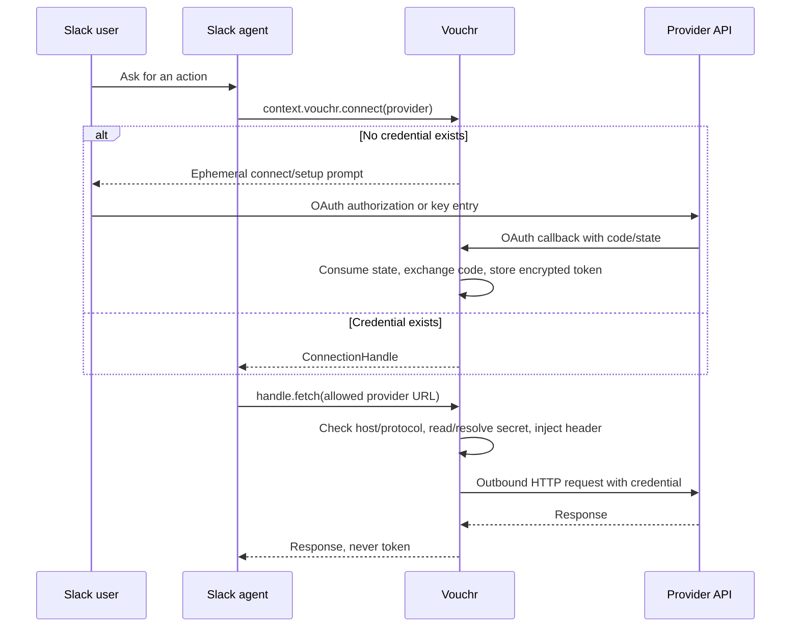

# Vouchr Assessment

Assessment date: 2026-06-27

This assessment reviews Vouchr as a product, system, and architectural direction. It is based on
the current repository contents, including the README, security policy, core implementation,
Slack Bolt adapter, examples, and tests. It is not a formal security audit, but it does examine
the security model because security is the main value proposition of the project.

## Executive Summary

Vouchr is a self-hostable credential broker for Slack-native AI agents. Its central idea is strong:
an agent should be able to act on behalf of a Slack user or channel without ever receiving the
underlying OAuth token, API key, or secret-manager-resolved value.

The system brings value by turning credentials into constrained capability handles. Application code
calls `context.vouchr.connect("github")` and receives a handle whose `fetch()` method injects the
secret only at the outbound HTTP boundary. This reduces credential exposure across the places where
AI systems are especially fragile: prompts, tool schemas, chat transcripts, logs, model context,
debug traces, and agent code paths that do not need direct access to secrets.

The repository is more than a concept demo. It contains:

- A provider-agnostic core.
- A Slack Bolt adapter with middleware, OAuth callback routing, slash commands, modals, and
  offboarding hooks.
- Per-user and per-channel credential ownership.
- OAuth and static-key credential paths.
- SQLite and Postgres storage.
- Encrypted token storage, optional envelope encryption, and external secret-manager references.
- Host allowlisting, HTTPS enforcement, manual redirect handling, token refresh, TTL sweeping,
  offboarding, and audit logging.
- A security-oriented test suite that exercises many of the project invariants offline.

Overall assessment: Vouchr is a high-potential, security-conscious foundation for Slack-based agent
credential delegation. It is not yet a polished production platform, and the repository says it has
not been run in production. But the design choices are directionally right, the core boundaries are
well drawn, and the implementation already demonstrates unusual care for a pre-1.0 project.

## The Goal

Vouchr is trying to solve a specific and increasingly important problem:

AI agents need to perform real actions in third-party systems, but giving the model or agent direct
access to user tokens is unsafe.

Without Vouchr, every Slack agent that needs to call GitHub, Google, GitLab, Notion, internal APIs,
MCP servers, or service-account-backed tools must solve the same hard problems:

- How does the user connect an account?
- Where is the token stored?
- How is it refreshed?
- How is access scoped to the correct Slack user, team, or channel?
- How do we keep the token out of prompts, logs, tool calls, and Slack messages?
- How do we revoke access when the user disconnects or leaves?
- How do we prevent a compromised prompt or model step from sending a token to an arbitrary host?

Vouchr's answer is to put a broker between the agent and the credential. The agent gets a narrow
handle. The broker owns the OAuth flow, vaulting, policy checks, injection boundary, and audit trail.

## The Vision

The broader vision appears to be:

Vouchr becomes the identity and credential boundary for Slack-native AI agents.

That vision has several layers:

1. Slack-native user experience
   - Users connect accounts through ephemeral Slack prompts.
   - Static keys are entered through private Slack modals.
   - Users can run `/vouchr status` and `/vouchr disconnect`.
   - Workspace admins can configure shared channel credentials.

2. Secret-safe agent development
   - Agent developers do not implement OAuth per provider.
   - Agent developers do not store or inspect user tokens.
   - Agent code uses a handle, not a secret.
   - The model can be given the handle's behavior without being given credential material.

3. Self-hosted trust boundary
   - Tokens stay in the operator's infrastructure.
   - Operators can use SQLite for a local/small deployment or Postgres for stateless/multi-instance
     deployments.
   - Operators can keep secret rotation in their own secret manager by storing references instead
     of raw secrets.

4. Provider-agnostic credential architecture
   - Built-in providers are examples, not hard-coded special cases.
   - Most OAuth2 providers are expressed declaratively.
   - Non-standard OAuth token endpoints are handled through provider knobs such as `tokenAuth` and
     `bodyFormat`.
   - Key-based providers are supported without forcing an OAuth shape.

5. Transport-agnostic core
   - The repository keeps most security logic in `src/core`.
   - The Slack/Bolt adapter consumes that core.
   - Tests enforce that `core` does not import Slack or adapter code.
   - This points toward a future sidecar or thin-client model where other languages and transports
     can reuse the same broker semantics.

The most compelling form of the vision is not "OAuth helper for Slack bots." It is closer to:

Vouchr is a capability firewall for AI agents acting through Slack.

## The Value It Brings

### 1. It removes repeated OAuth plumbing

Every serious agent eventually needs account linking. Rebuilding OAuth, token exchange, refresh,
state handling, storage, and disconnect flows for each agent is expensive and easy to get wrong.
Vouchr centralizes that work.

This has direct developer value:

- Faster agent development.
- Fewer bespoke token stores.
- Less repeated security-sensitive code.
- A single pattern across providers.
- A simpler mental model for application handlers.

The example usage is intentionally small:

```ts
const gh = await context.vouchr.connect('github');
const me = await (await gh.fetch('https://api.github.com/user')).json();
```

That is the right shape: the handler expresses intent, not credential mechanics.

### 2. It prevents the most obvious secret leaks by construction

The strongest product value is that secrets are not returned to the caller. The caller receives a
`ConnectionHandle`; the secret is read from storage and attached only inside `fetch()`.

This matters because AI agent systems have many accidental disclosure paths:

- The model context.
- Tool-call arguments.
- Chat history.
- Observability traces.
- Debug logging.
- Error strings.
- Human-visible Slack messages.
- Prompt-injected attempts to exfiltrate secrets.

Vouchr does not make an agent safe by itself, but it removes a major class of mistakes: code and
models cannot leak a token they were never handed.

### 3. It constrains where credentials can be sent

The injector checks the provider's `egressAllow` list before reading the secret. It also requires
HTTPS for non-loopback hosts and sets `redirect: 'manual'` so an allowlisted request does not
automatically follow a redirect elsewhere with the credential attached.

This is a meaningful line of defense. If an agent is tricked into fetching
`https://evil.example.com/steal`, the token is not even read from the vault.

This is not full authorization policy. Host allowlisting does not restrict paths, HTTP methods, or
provider-side scopes. But it is the right minimum boundary for a credential broker.

### 4. It preserves acting-human attribution

The owner of a credential and the acting identity are separate concepts:

- Owner: the user or channel whose credential is stored.
- Acting identity: the Slack human who triggered the request.

That separation is especially important for shared channel credentials. A shared credential should
not erase who caused the action. Vouchr's `ConnectionHandle` carries both and audits injection as
the acting human.

This is important for internal governance. Teams adopting agents need to know not just which token
was used, but which person initiated the action.

### 5. It supports both personal and shared credentials

Per-user credentials are the default, which aligns with least privilege and personal accountability.

Channel-owned credentials are also supported for shared service-account use cases, such as:

- A support channel using one Zendesk or internal API key.
- A finance channel using a shared read-only reporting credential.
- An incident channel using a service account for a runbook system.

The channel path is admin-gated, audited, and refused for Slack Connect/external shared channels,
DMs, group DMs, and archived channels. That is a thoughtful boundary because shared channel
credentials can otherwise become cross-organization leaks.

### 6. It can store references instead of secrets

For static credentials, Vouchr can store a reference such as an AWS Secrets Manager ARN instead of
the secret itself. The secret is resolved just in time by an operator-provided resolver and is never
persisted back to the Vouchr database.

This is valuable because many organizations already have a secret-management and rotation strategy.
Vouchr does not need to replace it. It can become the Slack/agent-facing credential broker while
leaving rotation and source-of-truth ownership elsewhere.

### 7. It gives operators a local path and a scalable path

SQLite is useful for a small self-hosted deployment, demo, or single-instance internal tool.
Postgres gives a more realistic path for stateless and multi-instance deployments.

The DB abstraction is deliberately small. It is not over-generalized into an arbitrary storage plugin
system. That fits the repository's stated principle: simplest thing that is actually correct.

### 8. It builds trust through tests

The tests focus on security invariants rather than only happy paths. They cover encryption,
single-use consent, provider generality, token exchange formats, egress blocking, HTTPS enforcement,
refresh behavior, TTL expiry, offboarding, owner isolation, channel restrictions, secret references,
installation storage, and the architecture boundary.

This is one of the strongest signals in the repository. The test suite reflects the product's risk
model.

## System Model

The main runtime flow is:



## Architecture Assessment

### Core

The core is appropriately transport-agnostic. The important modules are:

- `providers.ts`: Declarative provider definitions, built-ins, refresh strategies, egress allowlists,
  token endpoint options, custom injection.
- `consent.ts`: Single-use OAuth state and PKCE verifier storage.
- `oauthCallback.ts`: Shared OAuth callback handling.
- `tokens.ts`: OAuth code exchange and refresh exchange.
- `vault.ts`: Encrypted credential storage, external references, TTL logic.
- `injector.ts`: Connection handle, egress enforcement, secret injection, refresh-on-401, audit.
- `identity.ts` and `owner.ts`: Slack identity and credential owner modeling.
- `channelConfig.ts`: Shared/per-user channel mode and channel eligibility rules.
- `policy.ts`: Provider/channel allow/deny policy.
- `audit.ts`: Append-only audit events.
- `offboard.ts` and `sweep.ts`: Lifecycle cleanup.
- `db.ts`: SQLite/Postgres storage abstraction and schema.

The most important architectural decision is the split between `src/core` and `src/adapters`. It is
the right boundary. Security-sensitive rules live in core; Slack-specific surfaces live in the Bolt
adapter.

### Slack Adapter

The Bolt adapter is more complete than a thin proof of concept. It provides:

- Middleware that attaches `context.vouchr`.
- OAuth callback mounting.
- Connect prompts.
- Key setup prompts.
- Slash commands for status, disconnect, and configure.
- Private modals for raw keys or external references.
- Channel credential configuration.
- Slack deactivation offboarding.
- Multi-workspace installation storage support through `DbInstallationStore`.

The adapter mostly keeps Slack-specific concerns outside the core. That is good. The channel
eligibility rule is defined in core, while the adapter merely fetches Slack channel info. That is
also the right split.

### Storage

The storage model is compact and legible:

- `connection`: credential rows, keyed by `(team_id, owner_kind, owner_id, provider)`.
- `consent_request`: temporary OAuth state and PKCE material.
- `channel_config`: channel credential mode.
- `audit`: action log.
- `installation`: encrypted Slack installation records.

The owner key is a particularly important design detail. It prevents user-owned and channel-owned
credentials from colliding even if a user ID and channel ID happen to share a string.

### Provider Model

The provider abstraction is pragmatic. It supports:

- OAuth providers.
- Key-based providers.
- Bearer tokens by default.
- Custom header injection for non-Bearer APIs.
- PKCE on/off.
- Token endpoint Basic authentication.
- Form or JSON token request bodies.
- Provider-specific authorization parameters.
- Account probing.
- Refresh strategies.
- Egress allowlists.

This is a good level of abstraction. It avoids one-off provider hacks while not trying to model all
possible auth systems up front.

One limitation is intentional but worth noting: injection is currently header-only. If a provider
requires query-parameter signing or body-level signing, the provider model would need to expand.

## Security Assessment

### Strong Security Choices

Vouchr makes several strong choices:

- OAuth `state` is random, persisted, single-use, and consumed atomically with `DELETE ... RETURNING`.
- PKCE is supported for providers that need it.
- The egress allowlist is checked before the secret is read.
- Non-loopback egress must use HTTPS.
- Redirects are not automatically followed with credentials attached.
- Stored tokens are encrypted with AES-256-GCM.
- Optional envelope encryption supports KMS/Vault-style wrapping.
- External secret references are resolved just in time and not cached or persisted.
- Refresh token races are collapsed with single-flight behavior.
- Refresh updates do not reset max-age TTL.
- Credential owner and acting human are separate.
- Shared channel credentials are refused in externally shared channels, DMs, group DMs, and archived
  channels.
- Channel credential configuration is workspace-admin gated.
- Offboarding deletes user-owned credentials and pending consent requests.
- Audit records avoid token material in the current implementation and tests.

These are not surface-level security claims. Many are directly reflected in code and tests.

### Main Threats Mitigated

Vouchr materially reduces risk from:

- Accidental token leakage into model context.
- Prompt-injection attempts to reveal or redirect tokens.
- Agent code logging secrets it never receives.
- OAuth state replay.
- Cleartext bearer-token egress.
- Redirect-based token exfiltration.
- Cross-user or user/channel credential confusion.
- Deactivated users keeping their own connections alive.
- Rotating refresh tokens being broken by concurrent refreshes.

### Security Limits and Residual Risk

Vouchr is a credential boundary, not a complete authorization system.

Important residual risks:

- Host allowlisting does not restrict allowed paths, methods, request bodies, or provider-side
  actions. A handle for GitHub can call any allowlisted GitHub API endpoint permitted by the token.
- Provider/channel `Policy` is enforced in the per-user `connect()` path, but the shared channel
  credential path (`connectChannel`) does not appear to call the same policy check. That may be
  intentional, but it should be clarified or made consistent.
- The provider response is returned to the agent. Sensitive data from the provider can still enter
  the model or Slack reply unless the agent controls its own output behavior.
- Raw key entry through Slack modals means Slack receives the typed value as part of the modal
  submission. Vouchr does not echo or store it unsafely, but using external secret references is
  safer.
- `Audit.record` relies on callers not putting secrets into metadata. Current code follows that
  discipline and tests important paths, but a future guard or redaction layer would be stronger.
- Custom `accountProbe` functions are trusted provider code. A badly written custom provider could
  leak the access token during probing.
- Disconnect and offboarding delete local access but do not revoke upstream provider tokens.
- The admin gate is workspace-wide admin/owner status, not channel-membership-scoped. This is
  documented, but enterprises may want a more precise policy option.
- The SQLite file is not fully encrypted at rest. Token columns are encrypted, but operators still
  need infrastructure-level disk/database controls.
- The project says it has not yet been run in production.

These are manageable, but they should be clearly presented to adopters.

## Product Assessment

### Target User

The strongest target users are:

- Internal AI platform teams.
- Security-conscious engineering teams building Slack agents.
- Developer productivity teams integrating agents with GitHub, GitLab, Google, Notion, Jira-like
  systems, internal APIs, or MCP servers.
- Organizations that want self-hosted token custody rather than a SaaS intermediary.

Vouchr is probably not for teams that want a no-code SaaS dashboard first. It is currently a
developer-facing infrastructure component.

### Best Initial Use Cases

The best wedge use cases are:

- A GitHub Slack agent that opens issues, comments on PRs, or reads repo state as the user.
- A support channel agent that calls an internal support API with a shared channel credential.
- An internal MCP gateway where each user brings their own API key.
- A Google Workspace helper that reads user-specific profile or calendar data.
- An incident-response bot that uses channel-owned service-account credentials in approved channels.

These use cases are narrow enough to explain, useful enough to adopt, and security-sensitive enough
to make Vouchr's value obvious.

### Differentiation

Vouchr's differentiation is not just "stores OAuth tokens." Many libraries can do that.

The differentiation is:

- Slack-native consent.
- Secret never returned to the agent.
- Egress allowlist at injection time.
- Self-hosted custody.
- User and channel ownership model.
- Acting-human audit attribution.
- External secret-reference mode.
- Small core designed for future non-Slack adapters.

The positioning should lean into "credential boundary" and "capability handle" more than generic
OAuth helper language.

## Implementation Maturity

### What Looks Mature

- The core/adapter separation is clean.
- The test suite maps well to the security model.
- The storage schema is small and understandable.
- The provider abstraction solves real provider variation without one-off special cases.
- Lifecycle concerns are present: refresh, TTL, disconnect, offboard, sweep.
- The code avoids adding unnecessary dependencies for providers.
- Error paths generally avoid secret disclosure.
- The README communicates the core idea clearly.

### What Looks Pre-Production

- The project explicitly states it is pre-1.0 and not yet run in production.
- The package is private and not published.
- Operational docs are still thin for real deployments.
- Upstream provider token revocation is not implemented.
- No live Slack test exists, by design.
- Postgres requires a separate container path for full local verification.
- There are documentation inconsistencies that should be fixed before broader adoption.

### Documentation Inconsistencies

The public docs currently understate or conflict with the code in a few places:

- `README.md` says the embedded Bolt surface assumes a single workspace and says there is no
  `InstallationStore`. The code includes `DbInstallationStore` and `createVouchr` supports an
  `installationStore` option for multi-workspace token resolution.
- `README.md` and `package.json` require Node >= 20.6, while `CONTRIBUTING.md` says Node >= 18.
- The README status says pre-1.0 and not production-run, while the changelog mentions CI including
  a real Postgres backend. The production-readiness message should be made consistent.

These are not deep system flaws, but they can confuse adopters and reviewers.

## Verification Performed

Commands were run with Node v22.23.1, matching the repository's `.nvmrc`.

```bash
npm run typecheck
npm test
```

Results:

- Typecheck passed.
- Test suite passed: 54 passed, 0 failed, 1 skipped.
- The skipped test is the Postgres backend path, which requires a running Postgres instance
  (`npm run pg:up`).

An earlier run failed under Node 12 and Node 24 for environment reasons:

- Node 12 is too old for the repository.
- Node 24 did not match the installed native `better-sqlite3` build, which was compiled for Node 22.

After switching to Node 22 and allowing local loopback binding for the offline OAuth integration
tests, the suite passed.

## Strategic Recommendations

### Near-Term

1. Fix documentation drift.
   - Update the README's production notes to reflect `DbInstallationStore` and current
     multi-workspace capabilities.
   - Align Node version guidance across README, CONTRIBUTING, package metadata, and `.nvmrc`.
   - Add a production readiness checklist.

2. Make the threat model explicit.
   - Add a "What Vouchr does not protect against" section.
   - Explain that provider responses can still contain sensitive data.
   - Explain host allowlisting versus fine-grained authorization.
   - Explain Slack modal raw-key exposure and why external references are preferred.

3. Add upstream revocation support.
   - Extend providers with optional revocation metadata.
   - Make disconnect/offboard delete locally first, then revoke upstream best-effort.
   - Audit revocation attempts without leaking tokens.

4. Add stronger audit metadata safety.
   - Consider a typed audit metadata schema per action.
   - Add a defensive redaction/sentinel layer for obvious secret-shaped strings.
   - Keep the existing tests and add regression tests for audit metadata discipline.

5. Document production deployment recipes.
   - SQLite local.
   - Postgres multi-instance.
   - AWS Secrets Manager resolver.
   - KMS envelope encryption.
   - Slack app manifest and OAuth install flow.

### Medium-Term

1. Consider default-deny policy mode for enterprise deployments.
   - The current no-rule behavior allows a provider everywhere.
   - That is convenient, but enterprises may prefer explicit allowlists.
   - Clarify whether policy should govern both per-user and shared-channel credential use.

2. Expand egress policy beyond hostnames where needed.
   - Optional path prefixes.
   - Optional method restrictions.
   - Optional per-provider request validators.
   - Keep hostname allowlisting as the baseline.

3. Improve shared credential governance.
   - Optional channel-membership checks.
   - Admin role customization.
   - Inventory of channel-owned credentials.
   - Review/expiry workflows for shared credentials.

4. Add observability without secrets.
   - Metrics for connect prompts, successful connections, denied egress, refreshes, revocations,
     expired credentials, and resolver failures.
   - Structured logs that never include token material.

5. Build the sidecar/thin-client story.
   - The architecture already points in this direction.
   - A sidecar would let Python or other agent runtimes use the same credential broker without
     reimplementing the security model.

### Long-Term

1. Become the standard credential plane for Slack agents.
   - Own the mental model: user/channel credential broker, capability handles, audited injection.

2. Support more enterprise identity lifecycle paths.
   - SCIM-driven deprovisioning.
   - Enterprise Grid-aware offboarding across workspaces.
   - Credential inventory and periodic review.

3. Offer a stronger admin/operator experience.
   - CLI or web console for credential inventory.
   - Policy inspection.
   - Provider health checks.
   - Resolver/KMS diagnostics.

4. Create high-quality examples.
   - GitHub as user.
   - Google as user.
   - Internal API via user key.
   - Channel service account via AWS Secrets Manager.
   - Postgres plus KMS production template.

## Overall Judgment

Vouchr has a clear and valuable thesis: AI agents should act with delegated authority without
handling the secrets that make that authority possible.

The codebase largely supports that thesis. Its best qualities are the capability-handle interface,
the injection boundary, the owner/actor distinction, the egress checks, the single-use consent flow,
and the security-focused tests. Those are the parts that make the system more than a convenience
wrapper.

The biggest work before wider adoption is not a rewrite. It is product hardening:

- Tighten the docs.
- Clarify the threat model.
- Add upstream revocation.
- Add production deployment guidance.
- Make governance and observability more operator-friendly.
- Validate the system in a real Slack workspace and a real multi-instance deployment.

The foundation is strong. The project is still early, but it is early in the right direction.
