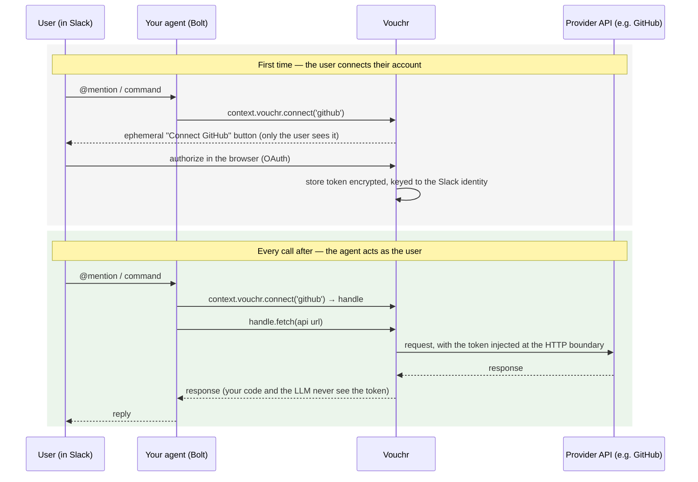

# Vouchr

**Let a Slack agent act on a user's behalf against third-party APIs — without the user's token ever touching your agent code, the LLM, or the chat.**

A Slack agent often needs to *do things as the user*: open a GitHub issue as them, read their
calendar, call an internal API with their access. That means storing per-user tokens, running a
"connect your account" flow, and using those tokens without leaking them. Vouchr is that piece,
as a drop-in for [Slack Bolt](https://slack.dev/bolt-js) — self-hosted, so tokens stay on your
infra.

The user connects once via an in-Slack button. Vouchr stores the token encrypted, keyed to their
Slack identity, and injects it only at the outbound HTTP call — your code gets a `fetch` handle,
never the secret.

## How it works



## Example

```ts
import { App, ExpressReceiver } from '@slack/bolt';
import { createVouchr, github } from 'vouchr';

const receiver = new ExpressReceiver({ signingSecret: process.env.SLACK_SIGNING_SECRET! });
const app = new App({ token: process.env.SLACK_BOT_TOKEN, receiver });

const vouchr = await createVouchr({ providers: [github()], baseUrl: process.env.PUBLIC_URL! });
app.use(vouchr.middleware);
vouchr.mountRoutes(receiver.router);   // the OAuth callback
vouchr.registerCommands(app);          // /vouchr status | disconnect | configure (+ the modals)
vouchr.registerOffboarding(app);       // revoke a user's connections when Slack deactivates them
setInterval(() => vouchr.sweepExpired(), 3_600_000); // hourly TTL sweep

app.event('app_mention', async ({ context, event, say }) => {
  // If the user hasn't connected GitHub, this posts a "Connect" button to them and stops.
  const gh = await context.vouchr.connect('github');

  // The token is attached inside fetch(), at the HTTP boundary — never visible here.
  const me = await (await gh.fetch('https://api.github.com/user')).json();
  await say(`You're *${me.login}* on GitHub.`);
});
```

## What you get

- **In-Slack connect** — a Block Kit button for OAuth providers; a private modal to paste a key
  for non-OAuth APIs. No vendor dashboard.
- **Leak-safe by construction** — the agent/LLM receives a handle, never a token. Secrets never
  reach logs, messages, the audit log, or error strings. Outbound calls are restricted to a
  per-provider host allowlist.
- **Per-user by default**, with **per-channel shared credentials** for service accounts an admin
  configures (e.g. one API key the whole `#support` channel's agents use).
- **Bring your own secret manager** — point a credential at an AWS Secrets Manager ARN (or any
  resolver); Vouchr stores the reference, not the secret, so rotation stays where it lives.
- **Encrypted store** — SQLite by default, Postgres for stateless/multi-instance deploys.
- **Lifecycle** — token auto-refresh, audit log keyed to the acting human, TTL, and automatic
  revocation when Slack deactivates a user.

## Setup

Requires Node ≥ 20.6 (developed on 22; `--env-file` needs 20.6).

```bash
npm install
cp .env.example .env     # set VOUCHR_MASTER_KEY (openssl rand -base64 32), Slack + provider creds
npm test                 # unit + integration, fully offline
npm run pg:up && npm test # optional: also exercise the Postgres backend (throwaway Docker PG)
```

### Slack app

Create an app from [`examples/slack-manifest.yml`](./examples/slack-manifest.yml)
(api.slack.com/apps → From a manifest), replacing `YOUR_PUBLIC_URL`. It sets the bot scopes
(`app_mentions:read`, `chat:write`, `commands`, `users:read`), the `app_mention` + `user_change`
events, **Interactivity** (required for the Connect button and the key/configure modals), and the
`/vouchr` slash command. `vouchr.registerCommands(app)` is what wires those modals and the command,
so it's mandatory if you use a `credential: 'key'` provider or channel config.

### Run the demo

You need the Slack app above, a GitHub OAuth app (callback
`$PUBLIC_URL/vouchr/oauth/callback`), and a public URL (`ngrok http 3000`):

```bash
npm run example:github   # then @-mention the bot in a channel
```

For Postgres instead of SQLite, set `VOUCHR_DATABASE_URL` (or `databaseUrl` in `createVouchr`).
Note the SQLite file itself isn't encrypted at rest, only the token columns are; keep it
access-controlled (see [SECURITY.md](./SECURITY.md)).

## Providers

Built-ins: `github()`, `google()`, `gitlab()`, `notion()`. Any other OAuth2 provider is a few
lines — set `egressAllow` (the hosts its token may be sent to), the refresh strategy, and PKCE:

```ts
const linear = defineProvider({
  id: 'linear',
  authorizeUrl: 'https://linear.app/oauth/authorize',
  tokenUrl: 'https://api.linear.app/oauth/token',
  scopesDefault: ['read', 'write'],
  egressAllow: ['api.linear.app'],
  refresh: 'none', pkce: false,
  clientId: process.env.LINEAR_CLIENT_ID!, clientSecret: process.env.LINEAR_CLIENT_SECRET!,
});
```

For a non-OAuth API, set `credential: 'key'` and how to attach it
(`inject: (h, key) => h.set('x-api-key', key)`); the user pastes their key into a private modal.

## Production notes

A few things an adopter hits in practice:

- **Workspaces / bot tokens.** A single-workspace app just sets `SLACK_BOT_TOKEN`. For an app
  installed to many workspaces or org-wide, pass a `DbInstallationStore` to both Bolt's OAuth
  `installationStore` and `createVouchr({ installationStore })` — the post-OAuth confirmation DM is
  then sent with the connecting user's own workspace token (resolved per enterprise and team).
  Credentials are isolated by `team_id` either way.
- **`ConsentRequiredError` is control flow, not an error.** When a user hasn't
  connected, `connect()` posts the Connect prompt and throws `ConsentRequiredError`.
  Catch it and stop the turn — don't log it as a failure:
  ```ts
  import { ConsentRequiredError } from 'vouchr';
  // inside your handler:
  try {
    const gh = await context.vouchr.connect('github');
    // ...use gh...
  } catch (e) {
    if (e instanceof ConsentRequiredError) return; // prompt was shown; wait for the user
    throw e;
  }
  ```
- **Storage at rest.** Token columns are encrypted with `VOUCHR_MASTER_KEY`, but the
  rest of each row — and the SQLite file as a whole — is not. Keep the DB
  access-controlled and the key in a secret manager; see [SECURITY.md](./SECURITY.md).

## Status

Pre-1.0. The embedded Bolt surface is built and tested (SQLite + Postgres); not yet run in
production. See [SECURITY.md](./SECURITY.md) for the security model and reporting, and
[CONTRIBUTING.md](./CONTRIBUTING.md) to help.

License: [Apache-2.0](./LICENSE).
