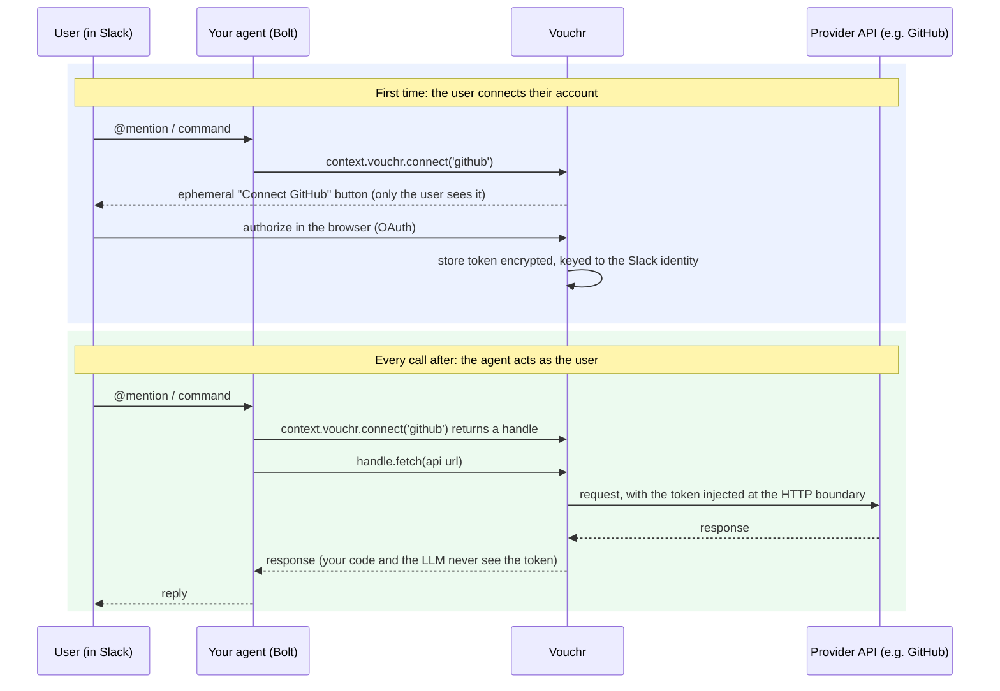

# Vouchr

[](https://github.com/Dharin-shah/vouchr/actions/workflows/ci.yml)
[](https://github.com/Dharin-shah/vouchr/actions/workflows/security.yml)
[](./LICENSE)
[](#setup)
[](#status)

**Let a Slack agent act on a user's behalf against third-party APIs, without the user's token ever touching your agent code, the LLM, or the chat.**

Your Slack agent can open a GitHub issue as the person who asked, query an internal API with *their*
access, or update a Jira ticket as them. Vouchr is the piece in the middle: the in-Slack "connect
your account" flow, the encrypted per-user token store, and credential injection at the outbound HTTP
call so the secret never reaches the model or the transcript. Self-hosted, a drop-in for
[Slack Bolt](https://slack.dev/bolt-js), so tokens stay on your infra.

```ts
app.event('app_mention', async ({ context, say }) => {
  const gh = await context.vouchr.connect('github');        // prompts the user to connect, if needed
  const me = await (await gh.fetch('https://api.github.com/user')).json();
  await say(`You're *${me.login}* on GitHub.`);              // acted as the user; the token never left Vouchr
});
```

**Docs:** [ARCHITECTURE.md](./ARCHITECTURE.md) · [THREAT-MODEL.md](./THREAT-MODEL.md) ·
[SECURITY-WHITEPAPER.md](./SECURITY-WHITEPAPER.md) · [DEPLOYMENT.md](./DEPLOYMENT.md)

## How it works



## What you get

- **Leak-safe by construction.** The agent and LLM receive a `fetch` handle, never a token. Secrets
  never reach logs, messages, the audit log, or error strings, and outbound calls are restricted to a
  per-provider host allowlist.
- **Acts as the human.** Per-user OAuth (or a pasted key for non-OAuth APIs), with every action
  audited against the acting person. No giant shared bot token.
- **Per-channel auth mode.** Each channel sets, per provider, whether `connect()` uses the user's own
  token (`per-user`), a shared channel token (`shared`), or a per-user token gated by a per-thread
  approval (`session`). [See below](#auth-mode-per-channel).
- **Bring your own secret manager.** Point a credential at an AWS Secrets Manager ARN (or any
  resolver); Vouchr stores the reference, not the secret, so rotation stays where it lives.
- **Encrypted store, full lifecycle.** SQLite by default, Postgres for multi-instance. Token
  auto-refresh, TTL, and automatic revocation when Slack deactivates a user.

## Setup

Requires Node ≥ 20.6 (developed on 22).

```bash
npm install
cp .env.example .env     # set VOUCHR_MASTER_KEY (openssl rand -base64 32), Slack + provider creds
npm test                 # unit + integration, fully offline
```

```ts
import { App, ExpressReceiver } from '@slack/bolt';
import { createVouchr, github } from 'vouchr';

const receiver = new ExpressReceiver({ signingSecret: process.env.SLACK_SIGNING_SECRET! });
const app = new App({ token: process.env.SLACK_BOT_TOKEN, receiver });

const vouchr = await createVouchr({ providers: [github()], baseUrl: process.env.PUBLIC_URL! });
app.use(vouchr.middleware);
vouchr.mountRoutes(receiver.router);   // the OAuth callback
vouchr.registerCommands(app);          // /vouchr status | disconnect | configure | mode (+ modals)
vouchr.registerOffboarding(app);       // revoke a user's connections when Slack deactivates them
setInterval(() => vouchr.sweepExpired(), 3_600_000); // hourly TTL sweep
```

Create the Slack app from [`examples/slack-manifest.yml`](./examples/slack-manifest.yml)
(api.slack.com/apps → From a manifest). Then, with a GitHub OAuth app (callback
`$PUBLIC_URL/vouchr/oauth/callback`) and a public URL (`ngrok http 3000`):

```bash
npm run example:github   # then @-mention the bot in a channel
```

## Auth mode per channel

Each channel decides, per provider, which credential model `connect()` uses. It is one setting, set
in Slack by an admin, not hardcoded in your agent:

```
/vouchr mode github     session    # per-user token, only inside the approving thread
/vouchr mode confluence shared     # one channel token (set via /vouchr configure)
/vouchr mode gdocs      per-user   # each user's own token (the default)
```

Your handler stays scope-agnostic; `connect(provider)` reads the mode and routes automatically:

```ts
const gh = await context.vouchr.connect('github');     // → thread session
const cf = await context.vouchr.connect('confluence');  // → channel token
const gd = await context.vouchr.connect('gdocs');       // → user token
```

In **session** mode the provider is usable only inside the thread the user approved it in; the
approval cannot be reused elsewhere. The first call posts an ephemeral "Allow github here" button and
throws `SessionApprovalRequiredError` (catch and stop the turn, like `ConsentRequiredError`). Grants
expire after a TTL ceiling (`sessionTtlMs`, default 8h) and are cleared on offboarding.

## Providers

Built-ins: `github()`, `google()`, `gitlab()`, `notion()`. Any other OAuth2 provider is a few lines
via `defineProvider`; for a non-OAuth API set `credential: 'key'` and how to attach it
(`inject: (h, key) => h.set('x-api-key', key)`).

```ts
const linear = defineProvider({
  id: 'linear',
  authorizeUrl: 'https://linear.app/oauth/authorize',
  tokenUrl: 'https://api.linear.app/oauth/token',
  scopesDefault: ['read', 'write'],
  egressAllow: ['api.linear.app'],          // hosts its token may be sent to
  refresh: 'none', pkce: false,
  clientId: process.env.LINEAR_CLIENT_ID!, clientSecret: process.env.LINEAR_CLIENT_SECRET!,
});
```

## Production notes

- **`ConsentRequiredError` is control flow, not an error.** When a user hasn't connected, `connect()`
  posts the Connect prompt and throws it. Catch it and stop the turn; do not log it as a failure.
- **Storage at rest.** Token columns are encrypted with `VOUCHR_MASTER_KEY`, but the rest of each row
  (and the SQLite file as a whole) is not. Keep the DB access-controlled and the key in a secret
  manager.
- **Multi-workspace / Postgres / KMS.** [DEPLOYMENT.md](./DEPLOYMENT.md) has copy-pasteable recipes
  and a [production readiness checklist](./DEPLOYMENT.md#production-readiness-checklist) to work
  through before going live. See [SECURITY.md](./SECURITY.md) for the security model and reporting.

## Status

**Pre-production. Not yet tested in a live deployment.** CI runs the full suite (including Postgres)
plus a security workflow (npm audit, gitleaks, SBOM, OWASP Dependency-Check) on every push and PR.
Review the [production readiness checklist](./DEPLOYMENT.md#production-readiness-checklist) before
adopting, and [CONTRIBUTING.md](./CONTRIBUTING.md) to help.

License: [Apache-2.0](./LICENSE).
