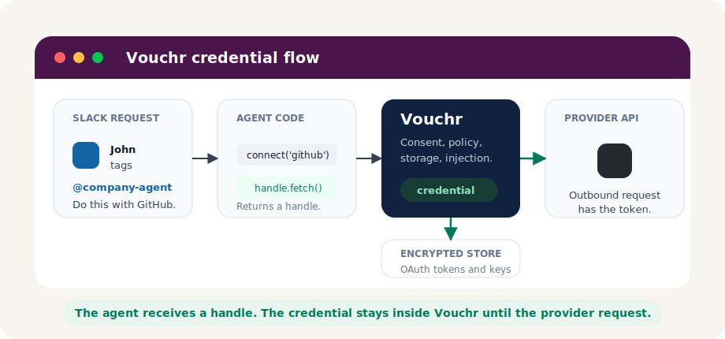

<div align="center">
<h1>Vouchr: Credential Broker for Slack Agents</h1>

 [](https://github.com/Dharin-shah/vouchr/actions/workflows/ci.yml) [](https://github.com/Dharin-shah/vouchr/actions/workflows/security.yml)  [](#quickstart) [](./LICENSE)

<p>
  <a href="#quickstart">Quickstart</a> |
  <a href="#how-it-works">How It Works</a> |
  <a href="#credential-modes">Credential Modes</a> |
  <a href="#providers">Providers</a> |
  <a href="#headless">Headless</a> |
  <a href="./guides/DEPLOYMENT.md">Deployment</a>
</p>
</div>

---

> [!IMPORTANT]
> **Vouchr is in alpha** and not yet tested in a live deployment. APIs may change between
> releases. Review the [production readiness checklist](./guides/DEPLOYMENT.md#production-readiness-checklist)
> before adopting — feedback and issues are very welcome!

**Vouchr is a self-hostable credential broker for Slack agents. Users connect or approve access in
Slack, your agent receives a safe handle, and Vouchr injects the right credential only at the
outbound HTTP request.**

When an agent needs to write to a user's tools, teams usually pick one of two unsafe patterns: one
broad bot token (every action looks like "the bot did it"), or user tokens passed through prompts,
tool code, and logs (where they leak). Vouchr gives the agent a narrower path:

- credentials are keyed to the Slack user or channel that authorized them
- the agent gets a `ConnectionHandle`, not a token
- `handle.fetch(url)` enforces the provider allowlist and attaches the credential inside Vouchr
- audit entries tie every action to the Slack identity that authorized it

Example: John asks `@company-agent create a follow-up meeting from this thread tomorrow`. The agent
calls `connect('google')` and makes the Calendar request through the handle — the event is created
from **John's** calendar, not a shared bot account. If someone else asks, Vouchr resolves *their*
connection and approval.

## Quickstart

Requires Node >= 22.

```ts
import { App, ExpressReceiver } from '@slack/bolt';
import { createVouchr, github } from '@vouchr/core';

const receiver = new ExpressReceiver({ signingSecret: process.env.SLACK_SIGNING_SECRET! });
const app = new App({ token: process.env.SLACK_BOT_TOKEN, receiver });

const vouchr = await createVouchr({ providers: [github()], baseUrl: process.env.PUBLIC_URL! });
vouchr.install(app, receiver); // middleware + OAuth callback + /vouchr command + offboarding + TTL sweep

app.event('app_mention', async ({ context, say }) => {
  const gh = await context.vouchr.connect('github');
  const me = await (await gh.fetch('https://api.github.com/user')).json();
  await say(`You're *${me.login}* on GitHub.`);
});
```

If the user hasn't connected yet, `connect()` posts a private prompt and throws
`ConsentRequiredError` — catch it and stop the turn. The user clicks once, finishes OAuth in the
browser, and asks again:


Session approvals ([thread-scoped](./assets/slack-session-thread.svg)) and private credential
modals ([non-OAuth keys](./assets/slack-secret-modal.svg)) are built in too. The app's **App Home
tab is a config console**: everyone manages their own connections there, and admins (plus channel
creators when `allowChannelCreatorConfig` is on) pick a channel and set per-provider modes, tool
availability, and shared credentials — the same server-side gates and audit rows as the `/vouchr`
equivalents. All Block Kit surfaces are exported for customization (`connectedBlocks`,
`statusBlocks`, `homeView`, …).

To run it: Vouchr uses **your agent's Slack app** — enable bot scopes `app_mentions:read`,
`chat:write`, `commands`, `users:read`, `channels:read`, `groups:read`, events `app_mention` +
`app_home_opened` + `user_change`, the App Home tab, interactivity, and the `/vouchr` slash command
(or start from [`examples/slack-manifest.yml`](./examples/slack-manifest.yml)).
Register each OAuth provider's app with callback `$PUBLIC_URL/vouchr/oauth/callback`. Then:

```bash
npm install && cp .env.example .env   # VOUCHR_MASTER_KEY, Slack secrets, provider OAuth creds
npm run example:github                # then @-mention the bot in a channel
```

Prefer finer control than `install()`? Each piece is callable individually:

```ts
app.use(vouchr.middleware);
vouchr.mountRoutes(receiver.router);   // /vouchr/oauth/callback
vouchr.registerCommands(app);          // /vouchr slash command
vouchr.registerOffboarding(app);       // revoke connections when Slack deactivates a user
setInterval(() => vouchr.sweepExpired(), 3_600_000);
```

## How It Works



1. Your handler calls `context.vouchr.connect('github')`.
2. Vouchr resolves the channel's credential mode; if access is missing, Slack shows a private
   prompt or modal and the turn stops.
3. Your handler receives a `ConnectionHandle` and calls `handle.fetch(url)`.
4. Vouchr checks the destination, attaches the credential inside Vouchr, and sends the request.

**Security boundary:** tokens live in Vouchr's encrypted store and the provider request. They never
enter the model, Slack transcript, tool schema, or application logs.

Deeper dives: [architecture](./guides/ARCHITECTURE.md) · [threat model](./guides/THREAT-MODEL.md) ·
[deployment](./guides/DEPLOYMENT.md).

## Credential Modes

Each channel chooses how a provider is authorized; your handler stays scope-agnostic —
`connect(provider)` reads the mode and routes automatically.

| Mode | What it means | Typical use |
| --- | --- | --- |
| `per-user` | Each person uses their own connected account. | GitHub, Google, Jira |
| `session` | A person's account is usable only inside the approving thread (TTL-bounded, default 8h). | Sensitive write actions |
| `shared` | The channel uses one admin-configured credential. | Team-owned tools, internal APIs |
| `union` | Any connected member's account may satisfy the request, acting (and audited) as that member. | Shared team channels |

### Union opt-in and owner notification

Delegating your identity to other members' requests should be explicit and visible (#112):

- **Explicit opt-in** — with `createVouchr({ unionRequiresOptIn: true })`, `union` resolution only
  borrows members who opted in for that (channel, provider): completing a Connect prompt posted in
  the union channel opts you in automatically, or run `/vouchr union join <provider>` (requires a
  connected credential; otherwise you get the Connect prompt). `/vouchr union leave <provider>`
  takes effect on the very next request, and disconnect/offboarding remove eligibility too. With
  nobody opted in, the requester simply gets the normal Connect prompt. Joins/leaves are audited
  (`union` action).
- **Owner notification** — when a union resolution serves someone *else's* request with your
  credential, Vouchr DMs you who used it and where, with pointers to `/vouchr audit` (the
  authoritative history) and `/vouchr union leave`. Debounced to one DM per
  (owner, provider, channel) per hour; never sent when you're serving yourself.

Enforcement scope: the resolution-time opt-in filter runs on the Bolt surface. The headless broker
trusts the host's signed `actingMemberId` by design — a host that resolves acting members itself
enforces the same rule with the exported `eligibleUnionMembers` (see `UnionOptin`,
`joinUnion`/`leaveUnion`, also on `./headless`), and broker-hosted OAuth callbacks record opt-ins
exactly like Bolt ones when `channelConfig` is wired.

> **Deprecation:** `unionRequiresOptIn` currently defaults to `false` (any connected member is
> borrowable — the pre-#112 behavior). This compatibility default **flips to `true` at the next
> breaking release**; set it explicitly today.

Admins govern this in Slack with `/vouchr`: `mode <provider> <mode>`, `enable`/`disable <provider>`
(per-channel tool allowlist enforced by `connect()`), `configure <provider>` (private modal for
shared credentials), `tools` (list the channel's manifest), `status`, and `disconnect`. Admin
commands are workspace-admin-only by default (`allowChannelCreatorConfig: true` extends them to the
channel's creator).

Running `/vouchr` with **no subcommand** opens an interactive modal: everyone sees their connected
accounts (with a Disconnect button each) and the channel's tool manifest; admins additionally get a
per-provider mode select, Enabled checkbox, and Private-previews checkbox that route to the same
mutations as the commands above (authorization is re-checked server-side on submit). The text
subcommands are unchanged. The Block Kit builder (`configModal`) and its callback id
(`CONFIG_CALLBACK`) are exported for headless hosts.

### Private previews

Orthogonal to the credential mode, each channel can set a provider's **preview visibility**
(`/vouchr preview <provider> <public|private>`, or the checkbox in the config modal). In a
`private` channel, output the agent posts through `context.vouchr.preview(provider, { title,
lines })` goes **ephemerally to the requester only**, with a Share button — provider data never
reaches the rest of the thread unless the human who saw it explicitly shares it (a single-use,
recipient-bound claim; the public post is attributed to them and audited as `preview`). `public`
(the default) posts normally. Agents discover the bit via `toolManifest()` in Bolt or
`POST /v1/manifest` on the headless broker — one core builder feeds both, so the two transports
can't drift; a host rendering with its own client is expected to honor it, and the `previewBlocks` /
`previewPostBlocks` builders are exported so that surface matches Vouchr's. Pending previews are
held in memory with a 10-minute TTL — a restart or timeout just means "preview expired, ask again".

Vouchr brokers credentials for tools that act **as a human**. Service-to-service tools
(`identity: 'service'`) act as the agent itself: the host wires its own auth and Vouchr refuses
`connect()`. `toolManifest()` reports each provider's identity — see
[`examples/channel-tool-manifest.ts`](./examples/channel-tool-manifest.ts).

## Providers

Built-ins: `github()`, `google()`, `gitlab()`, `notion()`.

A built-in is one credential, not one API product. A single `google()` connection covers Calendar,
Gmail, People, … — pick scopes and egress paths, and the user consents once:

```ts
const gcal = google({
  scopes: ['openid', 'email', 'https://www.googleapis.com/auth/calendar.events'],
  egressPaths: ['/calendar/v3/'],
  rateLimit: { perMinute: 60 }, // optional per-user throttle at the injection boundary
});
```

`rateLimit: { perMinute, burst? }` bounds how fast an agent can spend each owner's credential — a
looping (or prompt-injected) agent is refused **before the token is read**, so it can't get the
human's account rate-banned by the provider. Past the limit, Bolt tells the user ephemerally ("Slow
down…") and the headless broker returns 429 with a `Retry-After` header; callers can catch the
exported `RateLimitedError`. Absent = unlimited. Buckets are per-process by default — a
multi-replica deployment passes a shared `rateLimitStore` (same idea as the broker's `replayStore`).

`egressResponse: { maxBytes?, allowContentTypes?, stripHeaders? }` adds structural constraints on
the provider's **response** at the same boundary — shape only, deliberately no content/PII
inspection. `maxBytes` caps the body (fast-fail on Content-Length, then enforced while streaming;
an over-cap body is aborted at the cap, never returned even partially — a `SELECT *` gone wrong
can't blow out the model context). `allowContentTypes` allowlists exact bare media
types — parameters like `; charset=` ignored, so `['application/json']` admits
`application/json; charset=utf-8` but never `application/jsonp-evil` — and an HTML login page is
refused instead of being fed to the model as data. `stripHeaders` removes extra
response headers — and `Set-Cookie` is **always** stripped from every provider response, opt-in or
not, 3xx included: it's a credential-adjacent artifact the agent has no business seeing. A breach
denies like an egress denial: a thrown error (never the body), a `response_denied` event, and an
audit row. Absent = unchanged behavior (bar the unconditional cookie strip).

Any OAuth2 provider can be declared with `defineProvider` (hosts outside a built-in's egress
allowlist, e.g. `docs.googleapis.com`, need this too); non-OAuth APIs use `credential: 'key'` and
an `inject` function:

```ts
const linear = defineProvider({
  id: 'linear',
  authorizeUrl: 'https://linear.app/oauth/authorize',
  tokenUrl: 'https://api.linear.app/oauth/token',
  scopesDefault: ['read', 'write'],
  egressAllow: ['api.linear.app'],
  refresh: 'none',
  pkce: false,
  clientId: process.env.LINEAR_CLIENT_ID!,
  clientSecret: process.env.LINEAR_CLIENT_SECRET!,
});
```

More examples: [Google user credentials](./examples/google-user) ·
[internal API keys](./examples/internal-api-key) ·
[AWS Secrets Manager](./examples/aws-secrets-manager) ·
[GCP Secret Manager](./examples/gcp-secret-manager) ·
[Azure Key Vault](./examples/azure-key-vault) ·
[HashiCorp Vault](./examples/hashicorp-vault) ·
[Postgres + KMS](./examples/postgres-kms) ·
[sidecar broker](./examples/sidecar)

## Headless

Slack-facing service and agent workers in separate processes? The same core exposes an HTTP broker:
a verified Slack identity goes in, a provider response comes out, and the token stays inside Vouchr.

```ts
import { createBroker, signIdentity } from '@vouchr/core/headless'; // Bolt-free, no @slack/* loaded
```

Read-only by default (writes are a double opt-in), reference-only for secrets (raw keys stay in the
Bolt modal), with channel governance mirrored behind a signed admin claim. Providers that ship as
MCP servers over Streamable HTTP get a dedicated stateless proxy, `POST /v1/mcp` — the same gates
and credential injection as `/v1/fetch`, plus SSE stream passthrough and `Mcp-Session-Id` relay.
It is opt-in per provider (the declarative `mcp: { paths, allowContentTypes? }` knob locks the
endpoint and response types) and bounded by the `maxStreamBytes`/`maxStreamMs` broker options.
Full details — capability matrix vs Bolt, wire format, replay protection, health probes, and the
local sidecar for Python/Go/Rust/MCP runtimes — in the [headless guide](./guides/HEADLESS.md).

## Production Notes

- **Consent prompts are control flow.** `ConsentRequiredError` / `SessionApprovalRequiredError` mean
  Vouchr already prompted the user — catch them and stop the turn; don't log them as failures.
- **Credential health notifications.** When a refresh token dies for real (`invalid_grant` or a
  bare 400/401 from the token endpoint — never a transient blip or an operator-side error like
  `invalid_client`) or a connection is within 72h of its idle/max-age TTL ceiling (dimensions
  longer than 72h only — shorter ones would always be "expiring"), Vouchr DMs the credential owner
  (the configuring admin for a channel-owned credential): a reconnect button for a dead refresh
  (it mints a fresh consent link on click, so it can't expire unread), a heads-up for an upcoming
  expiry. At most one DM per (owner, provider, type) per 24h: the window is claimed atomically in
  the `notification_state` table before sending (no duplicates across replicas; a process that
  crashes between claim and send loses that window's DM — the next window retries), and
  reconnecting resets it. To route these yourself instead, set
  `createVouchr({ onCredentialHealth })` (or `BrokerOptions.onCredentialHealth` headless) — the
  exported `CredentialHealthEvent` carries the owning principal and provider, never token material.
- **Protect storage and keys.** Token columns are encrypted with `VOUCHR_MASTER_KEY`, but the
  database and key still need normal production controls. To rotate the master key without
  orphaning rows, set `VOUCHR_MASTER_KEYS` (first entry encrypts new writes, all entries decrypt)
  and run `vouchr rekey` — see the deployment guide's key-rotation runbook.
- **Follow the [deployment guide](./guides/DEPLOYMENT.md)** for Postgres, multi-workspace, KMS, and
  the production readiness checklist.

## Status

**Alpha. Not yet tested in a live deployment.** Every push and PR runs the full suite — 366 tests
across SQLite and Postgres at **97% line / 88% branch coverage** — plus CodeQL and dependency
security checks. Review the
[production readiness checklist](./guides/DEPLOYMENT.md#production-readiness-checklist) before
adopting, and see [CONTRIBUTING.md](./CONTRIBUTING.md) to help.

License: [Apache-2.0](./LICENSE).
