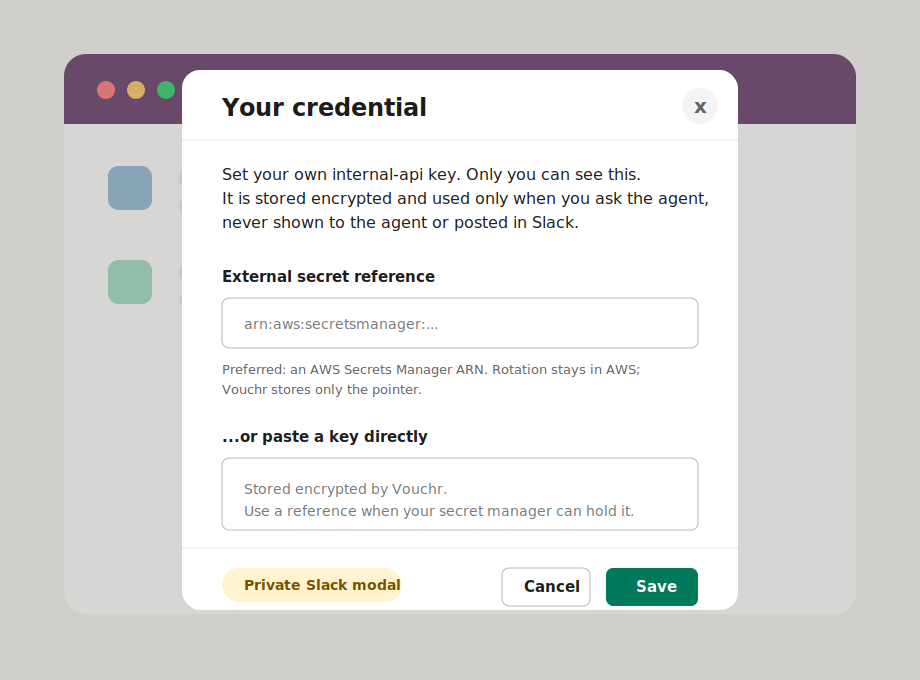

# Vouchr

[](https://github.com/Dharin-shah/vouchr/actions/workflows/ci.yml)
[](https://github.com/Dharin-shah/vouchr/actions/workflows/security.yml)
[](./LICENSE)
[](#setup)
[](#status)

**Vouchr lets a Slack agent act as the user who asked, without giving that user's token to the
agent, the LLM, logs, or the Slack transcript.**

Vouchr is a self-hosted middleware layer for [Slack Bolt](https://slack.dev/bolt-js). It gives your
agent a safe way to use the right credential for each request: per-user OAuth tokens, shared channel
credentials, or thread-scoped session approvals. It handles the Slack "connect your account" flow,
stores credentials encrypted, and injects them only when making an outbound HTTP request.

## What users see

Vouchr's Slack surfaces are intentionally small. These are illustrative mockups of the Block Kit
payloads; the live rendering comes from Slack and uses your app's name.

For OAuth providers, Vouchr sends the user a private Slack prompt with a Connect button.


For session-scoped providers, Vouchr asks for approval inside the current Slack thread only.


For non-OAuth APIs or shared channel credentials, Vouchr opens a private Slack modal instead:



## How Vouchr works

Vouchr sits between your Slack agent and provider APIs. Your agent asks for a connection; Vouchr
handles consent, storage, policy checks, and credential injection.


Without a broker, teams usually choose between a broad service token or passing user tokens through
tool code. Vouchr keeps both out of the agent path:

1. Your Bolt handler calls `context.vouchr.connect('github')`.
2. Vouchr resolves the channel's credential mode: `per-user`, `shared`, or `session`.
3. If access is missing, Slack shows a private prompt or modal and the turn stops.
4. The handler receives a `ConnectionHandle`, never a credential.
5. Requests go through `handle.fetch(url)`, where Vouchr enforces the provider allowlist and
   attaches the credential only for that outbound request.

**Boundary:** tokens live in Vouchr's encrypted store and the provider request. They do not enter the
model, Slack transcript, tool schema, or application logs.

## Minimal example

```ts
app.event('app_mention', async ({ context, say }) => {
  const gh = await context.vouchr.connect('github');
  const me = await (await gh.fetch('https://api.github.com/user')).json();

  await say(`You're *${me.login}* on GitHub.`);
});
```

If the user has not connected GitHub yet, `connect('github')` posts the private Slack prompt shown
above and throws `ConsentRequiredError`. Catch it and stop the turn. The user clicks once, finishes
OAuth in the browser, then asks again.

## What Vouchr handles for you

- **The connect UX:** Slack prompt, OAuth callback, and private key-entry modal for non-OAuth APIs.
- **A credential vault:** encrypted SQLite by default, Postgres for multi-instance deployments.
- **A safe HTTP boundary:** provider host allowlist, HTTPS checks, no token in your handler.
- **Acting as the human:** per-user credentials and audit entries tied to the Slack user.
- **Channel controls:** admins can choose per provider whether a channel uses `per-user`, `shared`,
  or `session` auth mode.
- **Lifecycle:** token refresh, TTL, disconnect, offboarding cleanup, and optional external secret
  manager references.

Need the deeper model? See [ARCHITECTURE.md](./ARCHITECTURE.md),
[THREAT-MODEL.md](./THREAT-MODEL.md), [SECURITY-WHITEPAPER.md](./SECURITY-WHITEPAPER.md), and
[DEPLOYMENT.md](./DEPLOYMENT.md).

## Setup

Requires Node ≥ 20.6 (developed on 22).

```bash
npm install
cp .env.example .env     # set VOUCHR_MASTER_KEY (openssl rand -base64 32), Slack + provider creds
npm test                 # unit + integration, fully offline
```

```ts
import { App, ExpressReceiver } from '@slack/bolt';
import { createVouchr, github } from 'vouchr';

const receiver = new ExpressReceiver({ signingSecret: process.env.SLACK_SIGNING_SECRET! });
const app = new App({ token: process.env.SLACK_BOT_TOKEN, receiver });

const vouchr = await createVouchr({ providers: [github()], baseUrl: process.env.PUBLIC_URL! });
app.use(vouchr.middleware);
vouchr.mountRoutes(receiver.router);   // the OAuth callback
vouchr.registerCommands(app);          // /vouchr status | disconnect | configure | mode (+ modals)
vouchr.registerOffboarding(app);       // revoke a user's connections when Slack deactivates them
setInterval(() => vouchr.sweepExpired(), 3_600_000); // hourly TTL sweep
```

Vouchr runs as middleware inside your existing Bolt agent, so it uses **your agent's own Slack app**.
Enable these on it (api.slack.com/apps) for Vouchr's in-Slack flow:

- **Bot scopes:** `app_mentions:read`, `chat:write`, `commands`, `users:read`
- **Events:** `app_mention`, `user_change`
- **Interactivity:** on (the Connect button and the key/configure modals)
- **Slash command:** `/vouchr`

Don't have an agent app yet, or just want to run the demo? Create one from
[`examples/slack-manifest.yml`](./examples/slack-manifest.yml) (→ From a manifest), which has all of
the above pre-filled.

Separately, register a **GitHub OAuth app** (callback `$PUBLIC_URL/vouchr/oauth/callback`). That is
the *provider* credential Vouchr brokers on the user's behalf, one per provider you support, and is
unrelated to Slack. Then, with a public URL (`ngrok http 3000`):

```bash
npm run example:github   # then @-mention the bot in a channel
```

## Auth mode per channel

Each channel decides, per provider, which credential model `connect()` uses. It is one setting, set
in Slack by an admin, not hardcoded in your agent:

```
/vouchr mode github     session    # per-user token, only inside the approving thread
/vouchr mode confluence shared     # one channel token (set via /vouchr configure)
/vouchr mode gdocs      per-user   # each user's own token (the default)
/vouchr mode jira       union      # any connected member's token, acting AS that member
```

Your handler stays scope-agnostic; `connect(provider)` reads the mode and routes automatically:

```ts
const gh = await context.vouchr.connect('github');     // → thread session
const cf = await context.vouchr.connect('confluence');  // → channel token
const gd = await context.vouchr.connect('gdocs');       // → user token
```

In **session** mode the provider is usable only inside the thread the user approved it in; the
approval cannot be reused elsewhere. The first call posts an ephemeral "Allow github here" button and
throws `SessionApprovalRequiredError` (catch and stop the turn, like `ConsentRequiredError`). Grants
expire after a TTL ceiling (`sessionTtlMs`, default 8h) and are cleared on offboarding.

In **union** mode `connect()` resolves against *whichever* channel member has connected the provider
and acts **as that member** — their own credential is used and **that member is the audited actor**,
never the caller and never the channel. It's still per-user credentials (there is no shared channel
token); union just widens resolution from "only you" to "any connected member", which fits a shared
team channel where anyone's connection should let the agent act. If no member is connected yet, the
caller gets the normal Connect prompt and becomes the first connected member. There is no owner/actor
conflation: the credential owner and the acting human are the same real person.

## When to use Vouchr vs a service-to-service MCP

Scoping "tools per channel" splits into two structurally different things that need different
mechanisms — the boundary is **whose identity the tool acts as**:

| | Acts as… | Credential | Use |
|---|---|---|---|
| **Per-human tool** (`identity: 'acting_human'`, default) | the human in the channel | that human's OAuth/key + explicit consent | **Vouchr.** `connect()` resolves the credential, runs the consent flow, and audits the acting human. |
| **Service-to-service tool** (`identity: 'service'`) | the agent itself | the agent's own service auth (internal egress allowlist) | **Not Vouchr.** There is no human credential to broker, so the host wires its own service auth. `connect()` on a `service` provider refuses with no consent flow. |

The trap is pushing a service-to-service tool through the consent flow — there's no human credential
there, so consent is meaningless. A provider declares which it is (`identity: 'service'` on
`defineProvider`; default `'acting_human'`), and `toolManifest()` reports it per provider so a host
can render one manifest with both kinds side by side. See
[`examples/channel-tool-manifest.ts`](./examples/channel-tool-manifest.ts) for a mixed manifest.

## Providers

Built-ins: `github()`, `google()`, `gitlab()`, `notion()`. Any other OAuth2 provider is a few lines
via `defineProvider`; for a non-OAuth API set `credential: 'key'` and how to attach it
(`inject: (h, key) => h.set('x-api-key', key)`).

```ts
const linear = defineProvider({
  id: 'linear',
  authorizeUrl: 'https://linear.app/oauth/authorize',
  tokenUrl: 'https://api.linear.app/oauth/token',
  scopesDefault: ['read', 'write'],
  egressAllow: ['api.linear.app'],          // hosts its token may be sent to
  refresh: 'none', pkce: false,
  clientId: process.env.LINEAR_CLIENT_ID!, clientSecret: process.env.LINEAR_CLIENT_SECRET!,
});
```

## Production notes

- **`ConsentRequiredError` is control flow, not an error.** When a user hasn't connected, `connect()`
  posts the Connect prompt and throws it. Catch it and stop the turn; do not log it as a failure.
- **Storage at rest.** Token columns are encrypted with `VOUCHR_MASTER_KEY`, but the rest of each row
  (and the SQLite file as a whole) is not. Keep the DB access-controlled and the key in a secret
  manager.
- **Multi-workspace / Postgres / KMS.** [DEPLOYMENT.md](./DEPLOYMENT.md) has copy-pasteable recipes
  and a [production readiness checklist](./DEPLOYMENT.md#production-readiness-checklist) to work
  through before going live. See [SECURITY.md](./SECURITY.md) for the security model and reporting.

## Status

**Alpha. Not yet tested in a live deployment.** CI runs the full suite (including Postgres)
plus a security workflow (npm audit, gitleaks, SBOM, OWASP Dependency-Check) on every push and PR.
Review the [production readiness checklist](./DEPLOYMENT.md#production-readiness-checklist) before
adopting, and [CONTRIBUTING.md](./CONTRIBUTING.md) to help.

License: [Apache-2.0](./LICENSE).
