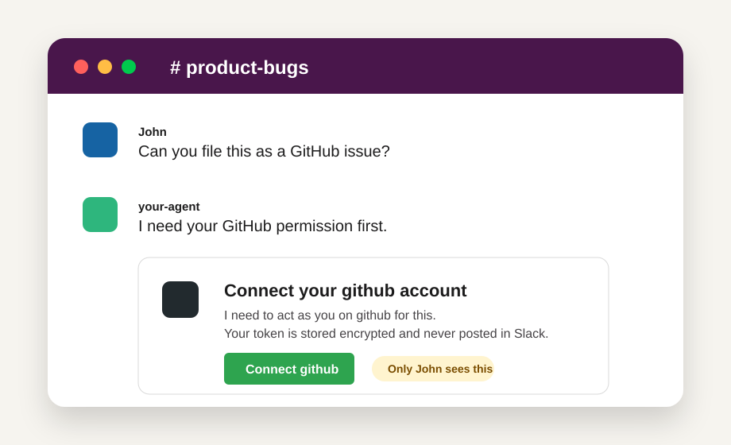

<div align="center">
<h1>Vouchr</h1>

**Let your agent read freely. Make it ask before it writes. Keep a record of everything.**

[](https://www.npmjs.com/package/@vouchr/core) [](https://github.com/Dharin-shah/vouchr/actions/workflows/ci.yml) [](https://github.com/Dharin-shah/vouchr/actions/workflows/security.yml) [](./LICENSE)

</div>

Reading GitHub, Google, or Jira with one shared token is usually fine. Writing is not. An agent
that creates issues, merges code, sends mail, or changes records needs three things:

1. It acts as the person who asked, with that person's own access.
2. Sensitive writes wait for a human. The team that owns the channel approves.
3. Every call is on record: who, what, where, and who approved.

Vouchr does these three things for Slack agents. It is self-hosted and runs on PostgreSQL. Your
code gets a handle, never a token. Vouchr adds the credential when the request leaves for the
provider, so the model, the transcript, and your logs never see it.

## Example

```bash
npm install @vouchr/core
```

```ts
import { App, ExpressReceiver } from '@slack/bolt';
import { createVouchr, github, ConsentRequiredError, safeUserMessage } from '@vouchr/core';

const receiver = new ExpressReceiver({ signingSecret: process.env.SLACK_SIGNING_SECRET! });
const app = new App({ token: process.env.SLACK_BOT_TOKEN, receiver });

// Needs VOUCHR_DATABASE_URL and VOUCHR_MASTER_KEY in the environment, and a one-time `npx vouchr migrate`.
const vouchr = await createVouchr({
  providers: [
    // Reads go through. Writes under /repos/ wait for a teammate's approval.
    github({ approval: { approver: 'member', methods: ['POST', 'PUT', 'PATCH', 'DELETE'], paths: ['/repos/'] } }),
  ],
  baseUrl: process.env.PUBLIC_URL!,
});
vouchr.install(app, receiver);

app.event('app_mention', async ({ context, event, client, say }) => {
  try {
    const gh = await context.vouchr.connect('github');
    const me = await (await gh.fetch('https://api.github.com/user')).json();
    await say(`You're *${me.login}* on GitHub.`);
  } catch (error) {
    if (error instanceof ConsentRequiredError) return; // Vouchr already posted a private Connect prompt.
    await client.chat.postEphemeral({ channel: event.channel, user: event.user!, text: safeUserMessage(error) });
    throw error;
  }
});
```

Channels are deny-by-default. A member of the channel runs `/vouchr enable github` once. The
first time someone uses the agent there, Vouchr asks them privately to connect their account.
After one browser sign-in, the agent works as them.



## Writes and sensitive paths

The `approval` setting on a provider says which calls need a human.

- `methods`: which HTTP methods wait. Leave it out and every method except GET and HEAD waits.
- `paths`: which paths wait. A prefix ending in `/` matches everything under it. Leave it out and
  every path waits.
- `approver`: `member` asks the channel that owns the credential. Any member other than the
  requester can approve. `self` asks the person driving the agent.

When the agent reaches one of these calls, Vouchr posts a prompt in the channel with who asked,
the provider, the method, and the host. One click approves exactly that call, once. Then the agent
continues to the next step and asks again when it has to. A credential only ever goes to the
provider's own hosts.

This is how an agent does most of a task alone and still stops at the steps that matter. It drafts
and reviews on its own, pauses to merge or to publish, and a teammate approves in Slack.

## Audit

Every connect, call, approval, denial, and disconnect is written to an audit table: time, person,
channel, provider, method, host, and outcome, and for approvals who approved. Secrets are never in it.

- `/vouchr audit` in Slack shows where your own credentials have been used.
- `/vouchr audit channel` shows a channel's shared-credential usage.
- `vouchr inventory` on the command line lists every live credential.
- The table is plain PostgreSQL. The [Prometheus example](./examples/prometheus) exports it.

## Credential modes

Each channel picks how a provider is authorized. Your handler code does not change.

| Mode | What it means | Typical use |
| --- | --- | --- |
| `per-user` | Each person uses their own connected account. | GitHub, Google, Jira |
| `session` | Usable only inside the approving thread, for a limited time. | Sensitive writes |
| `shared` | The channel uses one credential a channel member configures. | Team tools, internal APIs |

## Providers

Built in: `github()`, `google()`, `gitlab()`, `notion()`, `databricks()`. Any other OAuth2 API takes
about ten lines with `defineProvider`. API keys and secret-manager references work too. Ask only
for the scopes you use. See [provider configuration](./guides/DEPLOYMENT.md#provider-config-declarative).

## Agents outside Slack

Workers in another process or language call a private HTTP broker. The token still never leaves
Vouchr. A background agent with no Slack turn asks for approval with `POST /v1/authorization` and
polls for the answer. The prompt lands in the same channel. See the
[headless guide](./guides/HEADLESS.md).

## Quickstart

[QUICKSTART.md](./QUICKSTART.md) goes from nothing to a bot acting as you on GitHub. Plan on about
ten minutes of Slack and GitHub app setup, then a few minutes to run. It needs Node 22 or newer and
PostgreSQL.

## Learn more

| | |
| --- | --- |
| [Examples](./examples/README.md) | Google, Databricks, API keys, secret managers, broker client, MCP, Prometheus, SCIM, dry-run |
| [Architecture](./guides/ARCHITECTURE.md) | How consent, injection, and audit fit together |
| [Threat model](./guides/THREAT-MODEL.md) | What Vouchr defends against, and its limits |
| [Deployment](./guides/DEPLOYMENT.md) | PostgreSQL, KMS, Kubernetes, runbooks |
| [Headless](./guides/HEADLESS.md) | Broker API, error contract, replay protection |
| [Hybrid](./guides/HYBRID.md) | Slack app plus a private broker, in separate processes |
| [Operator CLI](./guides/CLI.md) | migrate, inventory, channels, revoke, rekey, prune, doctor |
| [Vision](./vision.md) | Product scope and roadmap |
| [Security](./SECURITY.md) | Security model and how to report issues |
| [Contributing](./CONTRIBUTING.md) | How to help |

## License

[Apache-2.0](./LICENSE).
