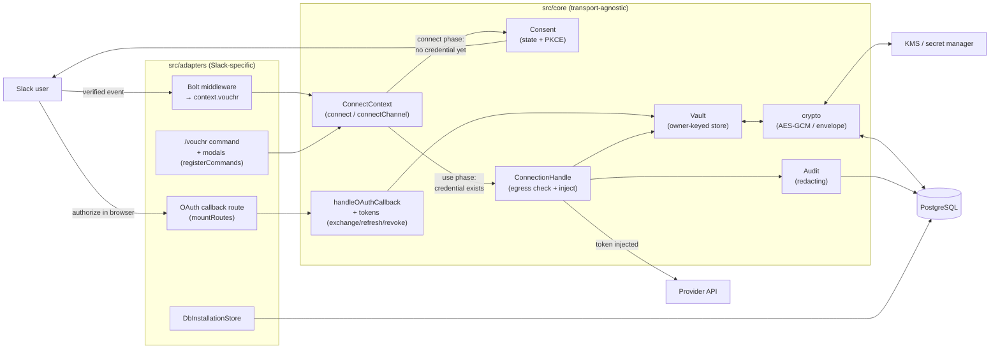

# Vouchr Architecture

Vouchr is a self-hosted Slack credential broker built on a single idea: the agent
receives a **capability handle**, never a secret. A user connects an account once via
an in-Slack button; Vouchr stores the token encrypted, keyed to the Slack identity (or
to a channel, for shared service accounts), and injects it **only at the outbound HTTP
boundary**, after an egress-allowlist check, so the token never reaches the agent code,
the LLM, the chat transcript, logs, or the audit table. Credentials are owner-scoped
(per-user by default, per-channel when an admin configures it) and isolated per Slack
tenant.

For the split-process version of this architecture—public Slack control plane plus a private
headless data plane—see the [hybrid deployment guide](./HYBRID.md).

## Component / data flow



Two phases:

- **Connect phase** (first time). `context.vouchr.connect('github')` finds no stored
  credential, so the adapter posts an ephemeral Block Kit "Connect" button (only the
  user sees it), records a single-use OAuth `state` + PKCE verifier, and throws
  `ConsentRequiredError` (control flow, not an error). The browser OAuth returns to the
  callback route, which consumes the state, exchanges the code, and vaults the encrypted
  token. Key providers instead get a private modal where the user pastes a key or an
  external reference.
- **Use phase** (every call after). `connect()` finds the stored credential and returns
  a `ConnectionHandle`. `handle.fetch(url)` checks the egress allowlist, reads the
  secret, injects it, calls the provider, refreshes on 401 if needed, and records an
  `inject` audit entry attributed to the acting human.

## Core / adapter boundary

The security logic lives in `src/core/`, which is **transport-agnostic**: it imports
nothing from `@slack/*` or `src/adapters/`. The Bolt adapter (`src/adapters/bolt.ts`)
is a thin consumer: it resolves identity and channel from verified Slack events, fetches
Slack-side facts (admin status, channel class), and delegates every security decision to
core.

This boundary is enforced by `test/architecture.test.ts`, which scans every file in
`src/core/` and fails if any imports `@slack/*` or `../adapters/`. The same test asserts
the channel-eligibility rule (`channelIneligibleReason`) lives in core.

Why it matters: the boundary lets the packaged deployment-bound **headless broker + thin HTTP
clients** (other languages) reuse the identical core and its security rules instead of
re-implementing them. The eligibility classification, owner keying, egress check, and crypto are
all decided in one place; an adapter only supplies verified inputs (e.g.
`conversations.info` output is passed to `channelIneligibleReason`, which fails closed on
`null`).

## Storage schema

One store, PostgreSQL only (stateless / multi-instance), behind a minimal async `Db`
seam (`src/core/db.ts`). A connection string is required; there is no embedded fallback.
Tables (`schema()` in `db.ts`):

| Table | Purpose | Key |
| --- | --- | --- |
| `meta` | Exact schema-version downgrade/startup guard | PK `key` |
| `connection` | Credentials (vaulted or external-reference), with PostgreSQL `generation_at` for delayed provider-addressed disconnect fencing | UNIQUE `(team_id, owner_kind, owner_id, provider)` |
| `consent_request` | In-flight OAuth `state` + PKCE verifier | PK `state` |
| `user_provisioning_request` | Opaque, single-use Slack user-key setup intent | PK `id`; UNIQUE `(team_id, user_id, provider)` |
| `channel_provisioning_request` | Opaque, single-use Slack channel-key setup intent | PK `id`; UNIQUE `(team_id, channel, user_id, provider)` |
| `channel_interaction_tombstone` | Latest channel/provider credential or effective-governance mutation; fences older setup receipts | PK `(team_id, channel, provider)` |
| `provisioning_revocation_tombstone` | Provider-scoped break-glass fence; scope identifiers are one-way selectors | PK `(provider, scope_key)` |
| `user_offboard_scope_tombstone` | Enterprise/unscoped/global user-authority fence | PK `(scope_kind, scope_id, user_id)` |
| `channel_config` | Per-channel auth mode (`shared` / `per-user` / `session`) | PK `(team_id, channel, provider)` |
| `channel_tool` | Per-channel tool allowlist (which providers an agent may use) | PK `(team_id, channel, provider)` |
| `session_grant` | Opt-in thread-scoped authorization (who may use a provider in which thread) | PK `(team_id, channel, thread, user_id, provider)` |
| `session_request` | Opaque pending thread-session control | PK `id`; UNIQUE exact thread context |
| `approval_request` | Opaque pending/granted exact-action approval | PK `id`; UNIQUE bounded `action_key` |
| `notification_state` | Credential-health DM debounce | PK `(team_id, owner_kind, owner_id, provider, type)` |
| `offboard_tombstone` | Team/user authority fence | PK `(team_id, user_id)` |
| `audit` | Append-only action log | PK `id` |
| `installation` | Encrypted Slack install (bot/user tokens) for multi-workspace | PK rowKey `(enterprise, team)` |
| `broker_jti` | Cross-replica single-use identity assertion replay guard | PK `jti` |

Every vault read/write is scoped by the **owner key `(team_id, owner_kind, owner_id,
provider)`**, and the UNIQUE constraint enforces one credential per principal+provider. `owner_kind` is `user` or `channel`; `team_id` is always the
authenticated user's, never derived from a channel id (`src/core/owner.ts`). This is the
tenant- and owner-isolation boundary.

Token columns (`access_token_enc`, `refresh_token_enc`) and the installation
`bot_token`/`data` are encrypted; the rest of each row is plaintext (see
[SECURITY.md](../SECURITY.md) for at-rest caveats). On validated public paths, a null `secret_ref`
means Vouchr holds an encrypted secret and a non-null value is an external reference resolved just
in time. Legacy/privileged low-level rows are treated as untrusted metadata: inventory never prints
the value, and advertised source ids are revalidated before resolver I/O. A reference's `source`
may also be `vault` for HashiCorp Vault, so `source` alone does not distinguish the two forms.

## Provider model

A `Provider` is **declarative OAuth2** (`src/core/providers.ts`): `authorizeUrl`,
`tokenUrl`, `scopesDefault`, a `refresh` strategy (`rotating` / `static` / `none`),
`pkce`, and an `egressAllow` host list. Built-ins: `github()`, `google()`, `gitlab()`,
`notion()`; most custom providers are ~10 lines via `defineProvider`. Knobs cover
real-world divergence without special-casing: `tokenAuth: 'basic'` and
`bodyFormat: 'json'` (Notion), `authorizeParams` (Google's `access_type=offline`),
`inject` (non-Bearer attach, e.g. `x-api-key`).

- **Key providers** (`credential: 'key'`) carry no OAuth client; the user pastes a static
  key or an external reference into a private modal.
- **Revoke** is declarative (RFC 7009 `revokeUrl` + optional `revokeAuth: 'body'`) with a
  `revoke` function escape hatch for non-standard endpoints (GitHub's DELETE + Basic
  auth). Honest no-op when a provider has no documented endpoint (Notion).
- **Envelope encryption** is runtime-optional and backward-compatible (`EnvelopeProvider`,
  `src/core/crypto.ts`): a fresh per-secret data key encrypts the secret and is wrapped by an external
  KEK (KMS/Vault). The production vision requires it for Vault connection tokens. Without it,
  secrets use direct master-key encryption; reads dispatch on the stored format, so both modes remain
  readable during migration. Slack installation tokens still use direct encryption pending #241.
- **External references** (`Resolvers`, `src/core/injector.ts`): a credential can point at
  an external secret manager (e.g. an AWS Secrets Manager ARN). Vouchr stores only the
  non-secret ref and resolves it JIT at injection time. The **resolved secret value** is
  never persisted, cached, or logged. Public Bolt/headless configuration paths derive the source
  from a bounded supported reference form and require a configured resolver before persistence or
  audit; they do not invoke the resolver until injection. Rotation stays where the secret lives.

## Lifecycle

```
consent → callback → vault → inject → refresh → TTL/sweep → offboard/revoke
```

1. **Consent** (`src/core/consent.ts`). `begin()` mints a single-use `state` (32 random
   bytes) + PKCE verifier, persists the consent row, and builds the provider authorize
   URL. Headless/user flows use `beginFenced()` so an assertion or Slack demand that predates
   offboarding cannot mint fresh callback authority after the fence.
2. **Callback** (`src/core/oauthCallback.ts`). `consume()` atomically deletes the state
   (`DELETE ... RETURNING`, single-use, 10-min TTL), the code is exchanged for tokens,
   an optional `accountProbe` fetches a human-readable label, and the token is vaulted.
3. **Vault** (`src/core/vault.ts`). `upsert` stores a vaulted credential (resets
   `created_at`); `reference` stores an external-ref credential; both are owner-keyed. Every
   user-owned OAuth, static-key, dry-run, and reference write converges on one credential-lock →
   applicable break-glass locks → offboard locks → latest-tombstone fence, with its config/connect
   audit in the same transaction. Shared-channel setup and the exported low-level channel Vault
   writers use the corresponding scoped break-glass fence. Built-in Slack channel setup first opens
   an authority-free loading view, then stores an opaque actor/channel/provider request; the final
   credential transaction consumes that request with `DELETE ... RETURNING`, so duplicate submit,
   write, mode/satellite cleanup, and config audit are one atomic outcome.
4. **Inject** (`src/core/injector.ts`). `handle.fetch()` enforces egress allowlist +
   HTTPS and revalidates the retained acting-user receipt plus current governance, session, and
   credential generation before stateful gates. It reads/resolves the secret only after those gates,
   revalidates again at the provider-send boundary, attaches it (`redirect: 'manual'`), touches the
   idle timer, and audits as the acting human. A request already handed to the provider cannot be
   recalled by a later offboard event.
5. **Refresh.** On a 401 (or near-expiry) for a vaulted OAuth credential, a single-flight
   refresh (`inflight` map dedups concurrent refreshes of a rotating token) updates the
   tokens via `updateTokens`, which leaves `created_at` intact, so refresh cannot defer
   the max-age TTL.
6. **TTL / sweep** (`src/core/sweep.ts`, `vault.ts`). `get()` returns `null` for an
   expired connection (lazy expiry); a periodic `sweepExpired()` deletes idle/aged rows
   (default idle 7d / max-age 30d) and clears stale consent. Filtering happens in SQL.
7. **Disconnect / offboard / break-glass revoke** (`src/core/offboard.ts`, `src/core/tokens.ts`).
   `/vouchr disconnect` is a provider-scoped local delete plus satellite cleanup and best-effort
   upstream revoke. It writes an exact provider/owner provisioning marker (but no offboard
   tombstone), so already-issued setup/OAuth authority cannot undo the deletion while a fresh later
   reconnect remains allowed.
   Slack deactivation and SCIM offboarding first commit a monotonic team or enterprise/global scope
   tombstone before cleanup/artifact discovery, including an otherwise-empty workspace. The local
   credential is deleted first (the security-meaningful cleanup); pending consent, setup requests,
   requester-bound approvals, and
   thread session grants are purged best-effort, and an upstream revoke is attempted best-effort
   only for a real row when the provider
   supports it and the claim supplies a usable vaulted token. A real revocable external reference
   or unreadable token is still removed locally but leaves upstream revocation unconfirmed;
   non-revocable and trusted dry-run rows are intentional skips. The Grid/SCIM
   `offboardUserEverywhere` sweep applies the same cleanup across every team. The offboard
   tombstones—not bounded-state purge success—are the load-bearing barrier against later user
   provisioning and retained use. Approval decisions and consumption compare trusted actor/request
   creation times with those tombstones. Channel/shared credentials are intentionally left for an
   admin to review and remain usable by other current actors; the departed actor's older handles and
   assertions are refused before secret access and provider send.
   Separately, confirmed `vouchr revoke --yes` commits one exact provider+scope marker before
   enumerating pending or live state. Matching older user and channel writers either finish before
   that marker and are found by the post-fence scan, or refuse afterward. Scope ids are stored only
   as fixed hashes, and a genuinely new setup after the marker remains possible.

**Per-channel auth mode.** `channel_config.mode` is the single source of truth for which credential
model `connect()` uses for a provider in a channel: `per-user` (the default), `shared` (route to the
channel credential), or `session`. `connect()` resolves the mode and routes accordingly, so the
model is configured in Slack (`/vouchr mode <provider> <mode>`), not hardcoded in the agent. In
PostgreSQL, shared-credential setup and mode changes take the same owner/provider advisory lock and
commit the credential row, mode, satellite cleanup, and audit together. A mode change to `per-user`
or `session` therefore cannot race setup into leaving a dormant shared credential. In addition,
every effective credential/mode/tool mutation advances a PostgreSQL-clock channel
interaction tombstone in that transaction. A setup handler compares it with the original verified
Slack receipt before hydrating or consuming the form, closing the window while `views.open` or
admin checks are pending. Same-value governance retries do not advance the marker. Envelope/KMS
wrapping is prepared before any credential, revocation, or actor-offboard lock is acquired. In
`session` mode `connect()` adds an authorization gate before the credential is resolved: the
provider is usable only inside the Slack thread the user approved it in (a grant keyed
`(team_id, channel, thread, user_id, provider)`), with a TTL ceiling. Grants live in `session_grant`,
are cleared on offboarding, and are removed by `sweepExpired()`.

See [SECURITY.md](../SECURITY.md) for the security model and limits, and
[THREAT-MODEL.md](./THREAT-MODEL.md) for trust boundaries, the attacker model, and the
enforced invariants.
