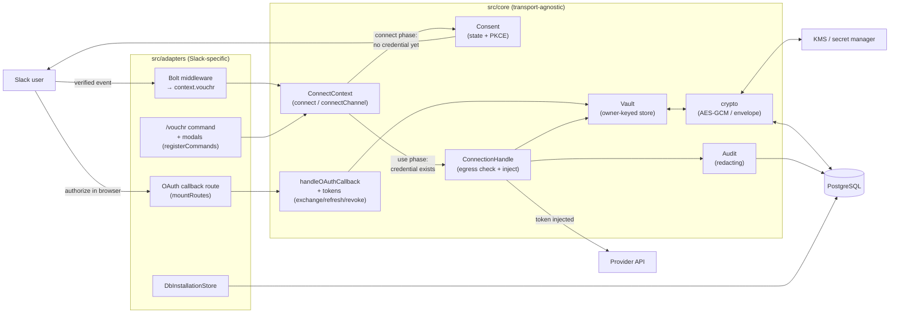

# Vouchr Architecture

Vouchr is a self-hosted Slack credential broker built on a single idea: the agent
receives a **capability handle**, never a secret. A user connects an account once via
an in-Slack button; Vouchr stores the token encrypted, keyed to the Slack identity (or
to a channel, for shared service accounts), and injects it **only at the outbound HTTP
boundary**, after an egress-allowlist check, so the token never reaches the agent code,
the LLM, the chat transcript, logs, or the audit table. Credentials are owner-scoped
(the person's own by default, the channel's when a member connects a shared credential) and isolated per Slack
tenant.

For the split-process version of this architecture—public Slack control plane plus a private
headless data plane—see the [hybrid deployment guide](./HYBRID.md).

## Component / data flow


```mermaid
flowchart LR
    user["Slack user"]

    subgraph adapter["src/adapters (Slack-specific)"]
        mw["Bolt middleware\n→ context.vouchr"]
        cb["OAuth callback route\n(mountRoutes)"]
        cmd["/vouchr command\n+ modals (registerCommands)"]
        instore["DbInstallationStore"]
    end

    subgraph core["src/core (transport-agnostic)"]
        cc["ConnectContext\n(connect / connectChannel)"]
        consent["Consent\n(state + PKCE)"]
        oauth["handleOAuthCallback\n+ tokens (exchange/refresh/revoke)"]
        vault["Vault\n(owner-keyed store)"]
        handle["ConnectionHandle\n(egress check + inject)"]
        crypto["crypto\n(AES-GCM / envelope)"]
        audit["Audit\n(redacting)"]
    end

    db[("PostgreSQL")]
    prov["Provider API"]
    kms["KMS / secret manager"]

    user -->|verified event| mw --> cc
    cc -->|"connect phase:\nno credential yet"| consent --> user
    user -->|authorize in browser| cb --> oauth --> vault
    cc -->|"use phase:\ncredential exists"| handle
    handle -->|token injected| prov
    vault <--> crypto <--> db
    crypto <--> kms
    handle --> vault
    handle --> audit --> db
    cmd --> cc
    instore --> db
```

Two phases:

- **Connect phase** (first time). `context.vouchr.connect('github')` finds no stored
  credential, so the adapter posts an ephemeral Block Kit "Connect" button (only the
  user sees it), records one active workspace/user/provider OAuth `state` + PKCE verifier,
  and throws
  `ConsentRequiredError` (control flow, not an error). The browser OAuth returns to the
  callback route, which spends the state, exchanges the code, and vaults the encrypted
  token. A PostgreSQL delivery lease deduplicates Slack prompts across replicas. Attributable
  failures get fixed browser copy plus at most one immediate, best-effort private recovery-DM attempt;
  a process failure can drop it, and unknown/replayed state stays generic. Key providers instead get
  a private modal where the user pastes a key or an external reference.
- **Use phase** (every call after). `connect()` finds the stored credential and returns
  a `ConnectionHandle`. `handle.fetch(url)` checks the egress allowlist, reads the
  secret, injects it, calls the provider, refreshes on 401 if needed, and records an
  `inject` audit entry attributed to the acting human.

## Core / adapter boundary

The security logic lives in `src/core/`, which is **transport-agnostic**: it imports
nothing from `@slack/*` or `src/adapters/`. The Bolt adapter (`src/adapters/bolt.ts`)
is a thin consumer: it resolves identity (a `SlackIdentity`: `{ enterpriseId, teamId, userId }`)
and channel from verified Slack events, fetches
Slack-side facts (channel membership, channel class), and delegates every security decision to
core.

This boundary is enforced by `test/architecture.test.ts`, which scans every file in
`src/core/` and fails if any imports `@slack/*` or `../adapters/`. The same test asserts
the channel-eligibility rule (`channelIneligibleReason`) lives in core.

Why it matters: the boundary lets the packaged deployment-bound **headless broker + thin HTTP
clients** (other languages) reuse the identical core and its security rules instead of
re-implementing them. The eligibility classification, owner keying, egress check, and crypto are
all decided in one place; an adapter only supplies verified inputs (e.g.
`conversations.info` output is passed to `channelIneligibleReason`, which fails closed on
`null`).

### Low-level core consent API

For trusted custom adapters only: `Consent.begin()` and `beginFenced()` return the minimal
`ConsentRequest` `{ authorizeUrl, state }`, and `Consent.consume()` returns the classified
claim directly. The internal callback row (including PKCE material) is not a root-package
export. Prefer the packaged Bolt or broker callback path unless implementing another
trusted adapter.

### Handling `ConsentRequiredError`

`connect()` throws `ConsentRequiredError` when the user has no usable credential yet. Vouchr has
already posted the private Connect prompt, so the handler's only job is to stop the turn.

The error carries a `promptState`:

| `promptState` | Meaning |
| --- | --- |
| `'posted'` | A fresh prompt was just posted. |
| `'reused'` | A still-live prompt from moments ago was reused rather than re-posted. An in-channel prompt is an ephemeral, so it may no longer be visible; a re-ask 30 seconds or more after the last delivery re-posts it. An off-channel DM prompt is durable and is never re-posted. |

A host that goes silent on `'reused'` leaves a person who reloaded Slack with nothing on screen;
post `safeUserMessage(error)` privately in that state (see the README snippet).

Branch on the error class or its `code`, **never on message text** — `mapSafeError` copy differs by
state and is not a stable contract.

### Custom Slack transports

If your Bolt `App` uses a non-default Slack transport (a proxy, a custom `slackApiUrl`, or a TLS
agent), pass the same options as `slackClientOptions` to `createVouchr`, so Vouchr's own prompt and
DM posts use your transport too. Vouchr always layers a finite timeout, zero retries, rate-limit
rejection, and lease-safe queue concurrency on top of whatever you supply.

### Wiring without `install()`

`vouchr.install(app, receiver)` is a convenience that registers every Bolt-facing piece.
Hosts that need finer control (custom routers, their own sweep scheduler) can wire each
piece individually — the pieces are independent and this is exactly what `install()` does:

```ts
app.use(vouchr.middleware);
vouchr.mountRoutes(receiver.router);   // /vouchr/oauth/callback
vouchr.registerCommands(app);          // /vouchr slash command
vouchr.registerOffboarding(app);       // revoke connections when Slack deactivates a user
setInterval(() => vouchr.sweepExpired(), 3_600_000);
```

## Storage schema

One store, PostgreSQL only (stateless / multi-instance), behind a minimal async `Db`
seam (`src/core/db.ts`). A connection string is required; there is no embedded fallback.
Tables (`schema()` in `db.ts`):

| Table | Purpose | Key |
| --- | --- | --- |
| `meta` | Exact schema-version downgrade/startup guard | PK `key` |
| `connection` | Credentials (vaulted or external-reference), with PostgreSQL `generation_at` for delayed provider-addressed disconnect fencing | UNIQUE `(team_id, owner_kind, owner_id, provider)` |
| `consent_request` | Bounded OAuth generation, PKCE, consumption/supersession, and Slack delivery lease | PK `state`; partial UNIQUE active `(team_id, user_id, provider)` |
| `user_provisioning_request` | Opaque, single-use Slack user-key setup intent | PK `id`; UNIQUE `(team_id, user_id, provider)` |
| `channel_provisioning_request` | Opaque, single-use Slack channel-key setup intent | PK `id`; UNIQUE `(team_id, channel, user_id, provider)` |
| `channel_interaction_tombstone` | Latest channel/provider credential or effective-governance mutation; fences older setup receipts | PK `(team_id, channel, provider)` |
| `provisioning_revocation_tombstone` | Provider-scoped break-glass fence; scope identifiers are one-way selectors | PK `(provider, scope_key)` |
| `user_offboard_scope_tombstone` | Enterprise/unscoped/global user-authority fence | PK `(scope_kind, scope_id, user_id)` |
| `channel_config` | Who the agent acts as per channel and provider (`person` / `channel`) | PK `(team_id, channel, provider)` |
| `channel_tool` | Per-channel tool allowlist (which providers an agent may use) | PK `(team_id, channel, provider)` |
| `approval_request` | Opaque pending/granted approval; `grant_scope` is `once` (one exact call) or `thread` (every matching call in the approving thread) | PK `id`; UNIQUE bounded `action_key` |
| `notification_state` | Credential-health DM debounce | PK `(team_id, owner_kind, owner_id, provider, type)` |
| `offboard_tombstone` | Team/user authority fence | PK `(team_id, user_id)` |
| `audit` | Append-only action log | PK `id` |
| `installation` | Encrypted Slack install (bot/user tokens) for multi-workspace | PK rowKey `(enterprise, team)` |
| `broker_jti` | Cross-replica single-use identity assertion replay guard | PK `jti` |

Every vault read/write is scoped by the **owner key `(team_id, owner_kind, owner_id,
provider)`**, and the UNIQUE constraint enforces one credential per principal+provider. `owner_kind` is `user` or `channel`; `team_id` is always the
authenticated user's, never derived from a channel id (`src/core/owner.ts`). This is the
tenant- and owner-isolation boundary.

Token columns (`access_token_enc`, `refresh_token_enc`) and the installation
`bot_token`/`data` are encrypted; the rest of each row is plaintext (see
[SECURITY.md](../SECURITY.md) for at-rest caveats). On validated public paths, a null `secret_ref`
means Vouchr holds an encrypted secret and a non-null value is an external reference resolved just
in time. Legacy/privileged low-level rows are treated as untrusted metadata: inventory never prints
the value, and advertised source ids are revalidated before resolver I/O. A reference's `source`
may also be `vault` for HashiCorp Vault, so `source` alone does not distinguish the two forms.

## Provider model

A `Provider` is **declarative OAuth2** (`src/core/providers.ts`): `authorizeUrl`,
`tokenUrl`, `scopesDefault`, a `refresh` strategy (`rotating` / `static` / `none`, the
`RefreshStrategy` type), `pkce`, and an `egressAllow` host list. Built-ins: `github()`, `google()`,
`gitlab()`, `notion()`, `databricks()`; each takes a `ProviderConfig` (`clientId`, `clientSecret`,
`scopes`, the finer egress knobs), and `databricks()` a `DatabricksConfig` that adds the required
workspace `host`. Most custom providers are ~10 lines via `defineProvider`. Knobs cover
real-world divergence without special-casing: `tokenAuth: 'basic'` and
`bodyFormat: 'json'` (Notion), `authorizeParams` (Google's `access_type=offline`),
`inject` (non-Bearer attach, e.g. `x-api-key`).

- **Key providers** (`credential: 'key'`) carry no OAuth client; the user pastes a static
  key or an external reference into a private modal.
- **Revoke** is declarative (RFC 7009 `revokeUrl` + optional `revokeAuth: 'body'`) with a
  `revoke` function escape hatch for non-standard endpoints (GitHub's DELETE + Basic
  auth). `revokeTarget` (`RevokeTarget`: `access` / `refresh` / `both` / `grant`) declares whether
  complete invalidation requires the access token, refresh token, both, or one grant-level
  operation; refresh-capable revocable providers must be explicit.
  Honest no-op when a provider has no documented endpoint (Notion).
- **Envelope encryption** is runtime-optional (`EnvelopeProvider`, `src/core/crypto.ts`): a fresh
  per-secret data key encrypts each secret and is wrapped by an external KEK (KMS/Vault). The
  production vision requires the same envelope instance for Vault connection tokens and
  multi-workspace Slack installation `bot_token`/`data`. Without it, those columns use direct
  master-key encryption. Vault reads direct transition rows while their key remains configured;
  installation rows additionally require the temporary `allowDirectRowsDuringMigration` option and
  are rewritten in the active format on their next install write. Production defaults fail closed.
  Every external wrap/unwrap is deadline- and admission-bounded and receives an `AbortSignal`;
  deployment-wide revocation can therefore continue local invalidation when KMS stalls. The built-in
  installation store also enforces the deployment lockdown before database or KMS access.
- **External references** (`Resolvers`, `src/core/injector.ts`): a credential can point at
  an external secret manager (e.g. an AWS Secrets Manager ARN). Vouchr stores only the
  non-secret ref and resolves it JIT at injection time. The **resolved secret value** is
  never persisted, cached, or logged. Public Bolt/headless configuration paths derive the source
  from a bounded supported reference form and require a configured resolver before persistence or
  audit; they do not invoke the resolver until injection. Rotation stays where the secret lives.

### Different scopes in different channels

Scopes come from the provider definition, so request exactly what you use:
`github({ scopes: ['read:user'] })` shows the user only "Read your profile" rather than the broad
`repo` default.

Scopes are per-provider, not per-channel (yet —
[#272](https://github.com/Dharin-shah/vouchr/issues/272)). Until then, define the provider twice
under distinct ids and gate them with channel tools or policy:

```ts
providers: [
  github({ scopes: ['read:user'] }),                                       // id: 'github' — read-only
  defineProvider({ ...github({ scopes: ['read:user', 'repo'] }), id: 'github-write' }),
]
// then enable `github-write` only in the channels that need writes, `github` elsewhere.
```

## Lifecycle

```
consent → callback → vault → inject → refresh → TTL/sweep → offboard/revoke
```

1. **Consent** (`src/core/consent.ts`). `begin()` mints or reuses one active generation per
   workspace/user/provider: a single-use `state` (32 random bytes) + PKCE verifier with a ten-minute
   bound. A channel/context change or fresh post-tombstone setup supersedes the old generation.
   Headless/user flows use `beginFenced()` so an assertion or Slack demand that predates offboarding
   cannot mint fresh callback authority after the fence. Bolt separately claims a short PostgreSQL
   delivery lease; confirmed delivery is reused, known rejection releases only that exact lease,
   and ambiguous delivery keeps it until takeover.
2. **Callback** (`src/core/oauthCallback.ts`). `consume()` atomically stamps `consumed_at` once,
   retaining the bounded row so authentic expiry/supersession can receive precise fixed recovery
   while unknown and replayed values remain generic. After token exchange and optional account
   probe, `finalizeProvisioning()` deletes the exact still-current generation inside Vault's
   credential transaction. That same transaction rechecks offboard/revoke tombstones and generation
   ordering (a live credential written at-or-after this consent was minted wins; a consent minted
   over an older live credential replaces it, so deliberate re-auth works), vaults the token, and
   writes the connect audit, so a paused older callback cannot overwrite newer authority. Bolt returns the browser result independently, then uses a
   finite-timeout/no-retry Slack client for one best-effort private recovery or success DM.
3. **Vault** (`src/core/vault.ts`). `upsert` stores a vaulted credential (resets
   `created_at`); `reference` stores an external-ref credential; both are owner-keyed. Every
   user-owned OAuth, static-key, dry-run, and reference write converges on one credential-lock →
   applicable break-glass locks → offboard locks → latest-tombstone fence, with its config/connect
   audit in the same transaction. Shared-channel setup and the exported low-level channel Vault
   writers use the corresponding scoped break-glass fence. Built-in Slack channel setup first opens
   an authority-free loading view, then stores an opaque actor/channel/provider request; the final
   credential transaction consumes that request with `DELETE ... RETURNING`, so duplicate submit,
   write, mode/satellite cleanup, and config audit are one atomic outcome.
4. **Inject** (`src/core/injector.ts`). `handle.fetch()` enforces egress allowlist +
   HTTPS and revalidates the retained acting-user receipt plus current governance and
   credential generation before stateful gates. It reads/resolves the secret only after those gates,
   revalidates again at the provider-send boundary, attaches it (`redirect: 'manual'`), touches the
   idle timer, and audits as the acting human. A request already handed to the provider cannot be
   recalled by a later offboard event.
5. **Refresh.** On a 401 (or near-expiry) for a vaulted OAuth credential, a single-flight
   refresh (`inflight` map dedups concurrent refreshes of a rotating token) updates the
   tokens via `updateTokens`, which leaves `created_at` intact, so refresh cannot defer
   the max-age TTL.
6. **TTL / sweep** (`src/core/sweep.ts`, `vault.ts`). `get()` returns `null` for an
   expired connection (lazy expiry); a periodic `sweepExpired()` deletes idle/aged rows
   (default idle 7d / max-age 30d) and clears stale consent. Filtering happens in SQL.
7. **Disconnect / offboard / break-glass revoke** (`src/core/offboard.ts`, `src/core/tokens.ts`).
   `/vouchr disconnect` is a provider-scoped local delete plus satellite cleanup and best-effort
   upstream revoke. It writes an exact provider/owner provisioning marker (but no offboard
   tombstone), so already-issued setup/OAuth authority cannot undo the deletion while a fresh later
   reconnect remains allowed.
   Slack deactivation and SCIM offboarding first commit a monotonic team or enterprise/global scope
   tombstone before cleanup/artifact discovery, including an otherwise-empty workspace. The local
   credential is deleted first (the security-meaningful cleanup); pending consent, setup requests,
   and requester-bound approvals (thread grants included) are purged best-effort, and an upstream revoke is attempted best-effort
   only for a real row when the provider
   supports it and the claim supplies a usable vaulted token. A real revocable external reference
   or unreadable token is still removed locally but leaves upstream revocation unconfirmed;
   non-revocable and trusted dry-run rows are intentional skips. The Grid/SCIM
   `offboardUserEverywhere` sweep applies the same cleanup across every team. The offboard
   tombstones—not bounded-state purge success—are the load-bearing barrier against later user
   provisioning and retained use. Approval decisions and consumption compare trusted actor/request
   creation times with those tombstones. Channel/shared credentials are intentionally left for an
   channel member to review and remain usable by other current actors; the departed actor's older handles and
   assertions are refused before secret access and provider send.
   Separately, confirmed `vouchr revoke --yes` commits one exact provider+scope marker before
   enumerating pending or live state. Matching older user and channel writers either finish before
   that marker and are found by the post-fence scan, or refuse afterward. Scope ids are stored only
   as fixed hashes, and a genuinely new setup after the marker remains possible.

**Prompt delivery and idempotency.** Approval prompts are persisted, opaque, single-use
controls: repeated agent turns reuse one durable request row, and a short cross-replica delivery
lease suppresses immediate duplicate prompts. A click is bound to the exact signed thread and
rechecks current access at the mutation; duplicate or stale clicks get fixed recovery copy instead
of silence. The pending request and its audit row commit together **before** Slack delivery. A
Slack delivery API rejection has an unknown acceptance outcome, so Vouchr retains the delivery
lease and keeps a possibly-visible button decidable while preventing an immediate duplicate; only a
known pre-delivery render/no-recipient failure removes the request. Definite versus ambiguous Slack
failures are classified separately, so the user is never told nothing was sent while a delivered
button may still be visible.

**Who the agent acts as.** `channel_config.identity` is the single source of truth for whose
credential `connect()` uses for a provider in a channel: `person` (the default, the asking human's
own connection) or `channel` (the channel's one connected credential). `connect()` resolves it and
routes accordingly, so it is configured in Slack (`/vouchr identity <provider> <person|channel>`, or
`/vouchr connect-shared`, which sets `channel`), not hardcoded in the agent. In PostgreSQL,
channel-credential setup and identity changes take the same owner/provider advisory lock and commit
the credential row, identity, satellite cleanup, and audit together, so a switch back to `person`
cannot race setup into leaving a dormant channel credential. Every effective credential/identity/tool
mutation advances a PostgreSQL-clock channel interaction tombstone in that transaction. A setup
handler compares it with the original verified Slack receipt before hydrating or consuming the form,
closing the window while `views.open` or membership checks are pending. Same-value governance retries
do not advance the marker. Envelope/KMS wrapping is prepared before any credential, revocation, or
actor-offboard lock is acquired.

**Approval is on by default.** Every call other than GET/HEAD needs a live grant unless the provider
sets `approval: false`; `methods`, `paths`, `approver` (`member` default, `self`), `grant` (`once`
default, `thread`), and `ttlMs` (5 minutes default) narrow or widen that. A `once` grant is spent
by one exact call; a `thread` grant is matched on its scope (team, channel, thread, requester,
provider) and covers every matching call there until it expires, so it is not deleted on consume.
Both live in `approval_request.grant_scope`, are cleared on offboarding and credential change, and
are removed by `sweepExpired()`. The agent's optional `reason` (500 bytes) and `https` `link`
(2,048 bytes) are validated in core (`assertReason`, `assertLink`), rendered on the prompt as plain
text, and the reason is written to the `approval_requested` audit row under `meta.reason`.

See [SECURITY.md](../SECURITY.md) for the security model and limits, and
[THREAT-MODEL.md](./THREAT-MODEL.md) for trust boundaries, the attacker model, and the
enforced invariants.
