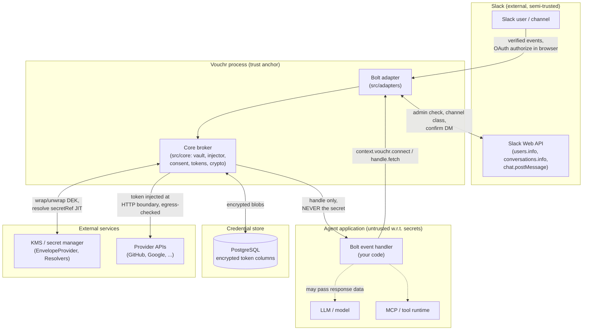

# Vouchr Threat Model

Vouchr is a self-hosted Slack-native credential broker. Its job is to let a Slack
agent act *as a user* against third-party APIs without the user's token ever
reaching the agent code, the LLM, the chat transcript, logs, or the audit table.
The token is injected only at the outbound HTTP call, after an egress check.

This document is a formal, honest threat model: trust boundaries, an attacker
model with concrete mitigations (and where there are none), and the security
invariants the code and tests enforce. It cross-references
[SECURITY.md](../SECURITY.md) rather than restating it; read that for the reporting
process and the explicit non-goals.

Every claim here is grounded in `src/core/*` and `src/adapters/*`.

## Trust boundaries

Boundaries, and what crosses each:

- **Slack ↔ Vouchr.** Vouchr trusts Slack-verified event payloads for identity
  and channel binding (signature verification is Bolt's responsibility, upstream of
  the adapter). The acting identity and channel are read from the verified event,
  never from caller-supplied arguments (`resolveIdentity`, `middleware` in
  `src/adapters/bolt.ts`). Raw keys typed into a Slack modal transit Slack's
  infrastructure (see SECURITY.md, "Raw keys typed into a Slack modal").
- **Agent app ↔ Vouchr.** The hard boundary. The agent (and therefore the LLM and
  any tool runtime) receives a `ConnectionHandle`, never the secret
  (`src/core/injector.ts`). The handle exposes `fetch()` and `account()` only.
- **Vouchr ↔ database.** Token material is stored encrypted with AES-256-GCM. The runtime supports
  direct master-key encryption; with a KMS `EnvelopeProvider` configured, both Vault connection
  tokens and multi-workspace Slack installation `bot_token`/`data` use per-secret DEKs wrapped by an
  external KEK (#241). The rest of each row and the Postgres database are not encrypted by Vouchr
  (`src/core/crypto.ts`, `src/core/db.ts`). At-rest protection of the database itself is the
  operator's job.
- **Vouchr ↔ external secret manager.** Two distinct integrations: `EnvelopeProvider`
  wraps/unwraps per-secret data keys (`crypto.ts`); `Resolvers` resolve a non-secret
  `secretRef` (e.g. an AWS Secrets Manager ARN) to a secret just-in-time, never
  persisted or cached (`injector.ts:resolveRef`). Both are operator-supplied; Vouchr
  ships no cloud SDK.
- **Vouchr ↔ provider API.** The only place a secret leaves the process. Egress is
  restricted to the provider's `egressAllow` host list, forced to HTTPS, and can be
  narrowed further by optional path/method/validator controls (`injector.ts:fetch`).
- **LLM / MCP / tool runtime.** Treated as fully untrusted for secrets. They sit
  *inside* the agent boundary and never receive a token by construction.

## Attacker model

For each attacker: the capability, then how Vouchr mitigates it (or honestly does
not).

### Malicious prompt / prompt injection

A crafted message or tool output tries to make the agent exfiltrate the token or
call an arbitrary host.

- **Token exfiltration: mitigated by construction.** The model never holds a token;
  it only ever sees a `ConnectionHandle`. There is no API that returns the secret to
  caller code; `fetch()` attaches it internally (`injector.ts`).
- **Arbitrary host call: mitigated.** Even if the prompt coerces the agent into
  calling `handle.fetch(attackerUrl)`, the egress allowlist rejects any host not in
  `provider.egressAllow`, *before any secret is read* (`injector.ts:fetch`, the
  allowlist check precedes `vault.get`). HTTP is also rejected (HTTPS-only, loopback
  exempt) so the bearer can't be downgraded to cleartext.
- **Not mitigated:** what the agent does with a *response body* it legitimately
  fetched. Vouchr keeps the token from the model, not the data the API returns (see
  SECURITY.md, "Provider responses flow back to your agent").

### Malicious user

A Slack user tries to use someone else's credential or read another tenant's data.

- **Mitigated.** Per-user connections are keyed by the verified acting identity
  (`userOwner(identity)`), which comes from the Slack event, not from any argument.
  A user can only `connect()` to their own connection. Tenant isolation is enforced
  by the full owner key on every query (invariant: full-key tenant isolation).
- A user cannot self-grant a channel credential: channel config is admin-gated
  (`requireAdmin`).

### Compromised channel

A channel is used to trick the agent into using a shared credential inappropriately,
or a channel changes class after a shared credential was configured.

- **Mitigated.** Shared (channel-owned) credentials are refused in ineligible channel
  classes (externally shared / Slack Connect, DMs/MPIMs, archived) at both config
  time and *use* time (`assertChannelEligible` is re-checked in `connectChannel`,
  `src/adapters/bolt.ts`). A channel turned Slack Connect after configuration stops
  working immediately.
- The eligibility rule lives in core (`channelIneligibleReason`,
  `src/core/channelConfig.ts`) and **fails closed**: if the channel class can't be
  read, the credential is refused.

### Compromised provider response

A provider (or a man-in-the-middle on the provider connection) returns a redirect or
malicious payload aiming to leak the bearer or pivot.

- **Redirect leak: mitigated.** `fetch` uses `redirect: 'manual'` so a 3xx is never
  auto-followed off the allowlisted host with the bearer attached (`injector.ts`).
- **Token-endpoint failures: mitigated against leakage.** Token/refresh/revoke errors
  never include the token in the error string (`src/core/tokens.ts`).
- **Not mitigated:** the contents of a 2xx response body, which flows back to the
  caller (same non-goal as prompt injection above).

### Rogue custom provider / accountProbe

A custom `Provider` (its `inject`, `revoke`, `accountProbe`) is itself the attacker,
or buggy.

- **Partially mitigated.** A custom provider runs inside the Vouchr process and is
  trusted with the token it is given. By design it must attach the secret somewhere.
  Vouchr constrains *where* outbound calls go (egress allowlist applies to
  `handle.fetch`), but a malicious `accountProbe`/`revoke`/`inject` could send the
  token to an arbitrary host or place caller-supplied data into audit metadata.
- This is an explicit operator-responsibility / non-goal: audit metadata is
  caller-supplied (SECURITY.md, "Audit metadata is caller-supplied"). Defense in
  depth: the audit layer redacts credential-shaped values anyway (`src/core/audit.ts`,
  `looksSecret`). Treat custom providers as trusted code.

### Database reader

An attacker with read access to the Postgres database.

- **Mitigated for token material.**
  `access_token_enc` / `refresh_token_enc` are AES-256-GCM encrypted; with an
  `EnvelopeProvider`, each Vault secret has its own DEK wrapped by an external KEK
  (`crypto.ts:seal`, `vault.ts`). Multi-workspace Slack installation `bot_token`/`data`
  follow the same scheme (#241): `DbInstallationStore` accepts the same envelope instance
  and seals both columns through `crypto.ts:seal`, so with a KMS envelope configured they
  are per-secret DEK + external-KEK envelope ciphertext (scheme `0x01`) — a database +
  direct-master compromise no longer exposes installation bot tokens. Envelope-enabled
  installation reads reject direct/keyed rows unless the operator explicitly opens the temporary
  `allowDirectRowsDuringMigration` cutover and rewrites them through re-install/re-auth; the
  production default never silently falls back. KMS timeout, overload, wrap, unwrap, malformed
  plaintext, and parser failures return fixed secret-free errors. `vouchr rekey` rotates direct-path master
  keys (it skips envelope rows, which rotate in the KMS) and does not itself convert direct
  rows to envelope.
- **Not mitigated by Vouchr:** the rest of each row (provider id, scopes, owner key,
  `secret_ref`, timestamps) and the Postgres database as a whole are plaintext. The master
  key in memory/env is also out of scope here. Operator must encrypt the database at rest
  and access-control it (SECURITY.md, "The Postgres database is not wholly encrypted at
  rest"; "Operator responsibilities").

### Network redirect / egress bypass

An attacker manipulates the request URL or DNS to send the bearer somewhere
unintended.

- **Mitigated before secret access.** Egress allowlist (`provider.egressAllow`) + HTTPS
  enforcement + `redirect: 'manual'` (`injector.ts`). Optional path/method/validator
  controls are checked in the same pre-secret block. URLs with embedded userinfo are
  refused before vault access.
- **Not fully mitigated:** provider-side scope/action restriction. Even with path/method
  narrowing, Vouchr is not the provider's authorization engine; constrain the token's
  own scopes and permissions at the provider. DNS rebinding against an allowlisted host
  is not specifically defended.

### Approval replay / bypass (human-in-the-loop writes, #113)

An attacker (a looping or prompt-injected agent) tries to stretch one human approval
into many actions, or to skip the approval entirely.

- **Mitigated.** The gate runs in the injector strictly AFTER every egress gate (an
  egress-denied target never even prompts — approval can widen nothing) and BEFORE the
  secret is read. A grant is SINGLE-USE — consumed with atomic `DELETE ... RETURNING`,
  so two concurrent retries cannot both spend it — TTL-bound (default 5 minutes), and matches ONLY the exact
  (method, origin, path, query) it was minted for: not a prefix, not a pattern, never a
  class of actions. The query is bound BYTE-EXACT, as a digest of the exact query string
  sent upstream — no sorting or normalization, since upstream parsers legitimately treat
  reordered or duplicated parameters differently — so a replanning or prompt-injected
  agent cannot spend an approval of `POST /transfer?to=alice&amount=10` on
  `?to=attacker&amount=1000000` (or on any reordering); any textual change re-prompts.
  Query parameter names and values are BOTH caller-controlled and may carry tokens,
  signed-URL material, or PII, so neither is ever persisted, audited, logged, or rendered.
  Origin binds scheme, hostname, and effective port, so a loopback approval on one development port
  cannot authorize another. Raw paths can carry sensitive material, so Slack, public errors, and audit show a fixed-size action
  fingerprint instead. It includes the random, non-output credential generation and every exact
  action field, preventing dictionary reversal of a low-entropy path; the prompt shows only that
  fingerprint and the parameter count. When `approval.paths` is set it
  inherits the egress path lock's fail-closed
  encoded-separator rule (a `%2f`/`%5c` in the path REQUIRES approval, so `/pay%2Fx`
  can't slip past a `/pay` lock unconfirmed). The grant is also bound to the **credential
  owner** it was minted against (user vs channel, and which user), so a later resolution
  switch — a per-user→shared mode change — no longer matches and
  re-prompts: the write can never run against a different credential than the human
  approved. And a grant is purged the moment its credential is deleted or replaced
  (disconnect, offboard, bulk-revoke, reconnect, TTL-expiry — all route through the one
  vault mutation surface), so it can't survive a revocation or be spent after a
  reconnect. Approve/Deny clicks are re-authorized server-side (provider re-validated
  against the registry; current owner, live credential, mode/session, policy, tool bit,
  signed conversation, and approver eligibility re-checked before the mutation; ineligible
  clicks are rejected and audited) — nothing in the interaction payload is trusted. Decision and
  consume mutations share a PostgreSQL transaction with their audit companion, so an audit failure
  grants or spends nothing. Mode/tool writers use the same canonical channel/provider lock and
  atomically purge every dependent pending request and grant; a session→per-user→session or
  enabled→disabled→enabled ABA cannot revive old authority. Exact-action dedup uses a bounded
  length-framed SHA-256 lookup key because PostgreSQL cannot btree-index a multi-KiB raw path, but
  every request/consume still compares all full action fields — the digest is never authority.
  Paths are capped at 16 KiB before mutable state or secret reads; the internal pending row keeps the
  bounded raw path solely for exact matching. Once a Slack call begins, rejection
  is an unknown acceptance outcome: the short database-clock lease and request are retained so a
  possibly-visible button remains decidable and an immediate retry cannot post a duplicate.
- **Accepted tradeoff:** the request BODY is not hashed into the grant key. Bodies are
  legitimately rebuilt on retry (fresh timestamps, idempotency keys), so binding to the
  payload bytes would break the approve-then-retry flow outright. Be explicit about what
  that means: for an API whose write target or amount lives in the BODY (JSON/RPC), an
  approval pins the origin + endpoint + method + query but NOT the body parameters — an agent
  that rebuilds the body differently between the prompt and the retry spends the grant
  on the rebuilt payload. Do not treat approval as covering the exact action for such
  endpoints; scope `approval.paths` tightly and prefer APIs that carry the
  action-defining parameters in the URL. (A digest over declared-stable body fields, or
  a provider-supplied action fingerprint, would close this; no built-in provider ships
  one today.) Approval prompts therefore show method, host, the salted action fingerprint, and query
  parameter count, while deliberately withholding the raw path/query and body.

### Replayed OAuth callback / state

An attacker replays or forges an OAuth `state` to bind a connection to the wrong
user or reuse a callback.

- **Mitigated.** `state` is 32 random bytes, single-use, and has a 10-minute authority TTL.
  `consume()` atomically stamps `consumed_at` only when it is null, so two concurrent callbacks
  cannot both pass (no get-then-update TOCTOU, correct even on multi-instance PostgreSQL). The
  authority-free row has a 24-hour retention threshold so an authentic expired link can receive fixed
  private guidance before the next sweep reclaims it; unknown/replayed input remains generic. After token exchange,
  the credential transaction conditionally deletes the exact still-active generation while
  rechecking offboard/revoke tombstones and generation ordering — a live credential written
  at-or-after the consent was minted refuses the write, while a newer consent replaces an older
  credential so re-authorization cannot dead-end. PKCE (S256) is sent when the
  provider enables it; the verifier is stored server-side in the consent row, not in the redirect.

### Forwarded consent link

A workspace insider forwards their own private Connect link to a colleague, who completes the
browser OAuth. The `state` binds the *initiating* Slack identity, so the colleague's provider
account is stored under the initiator's Slack user — and the agent then uses it on the
initiator's turns.

- **Not prevented; impact and detection reduced.** This is a real credential-confusion attack by
  a malicious workspace user — the same actor the "Malicious user" section models as an attacker,
  so it is **not** inside the trusted boundary. The disclosure controls below reduce its impact and
  make it detectable; they do not stop a determined insider. The browser session completing OAuth
  has no Slack authentication, so Vouchr cannot prove the person clicking is the person who asked —
  the structural limit of every start-in-chat, finish-in-browser flow (cf. RFC 8628 §5.4).

  **Delivery of the link differs by adapter, and only Bolt keeps it private:**
  - **Bolt** posts the Connect link as a private ephemeral (or DM), single-use, with a 10-minute
    TTL, one active generation per workspace/user/provider. Forwarding is a deliberate act by the
    initiator.
  - **The headless broker** does NOT deliver the link. `POST /v1/connect` returns
    `{ authorizeUrl, state }` to the calling host, which owns presentation entirely. Vouchr makes
    **no** privacy guarantee there — a headless operator MUST keep the authorize URL out of models,
    logs, public channels, and any surface a third party can reach, and is responsible for showing
    it only to the identity the `state` is bound to.

  Detection (both surfaces): the callback landing page (`connectedHtml`) names the bound Slack user
  and workspace AND links to that user's Slack profile (a `slack://user` deep link, so the completer
  can recognize *who* it is, not just an opaque id), and — when a provider account label is known
  (it can be null) — names that account. On Bolt, the initiator also receives the success DM. The
  provider's own consent screen names the app. Prevention (not yet shipped) requires binding the
  browser session to the Slack identity (Sign in with Slack / OIDC) before starting the provider
  OAuth — tracked privately; opt-in and ON-by-default for GA, not required for a supervised
  single-workspace pilot.

### Deactivated user

A user is deactivated in Slack but a pending OAuth or stored connection could let the
agent keep acting as them.

- **Mitigated.** On Slack's `user_change` with `deleted: true`, `offboardUser` first commits a
  monotonic `(team_id, user_id)` tombstone, then deletes all the user's own connections and
  best-effort purges in-flight consent, key-setup requests, and thread sessions. Every later
  user-owned OAuth, static-key, dry-run, or reference write checks that tombstone under the same
  cross-replica locks as its credential mutation. Retained Bolt handles and headless assertions
  compare their trusted receipt time with the same tombstone before stateful use/secret access and
  again at provider send. This applies to channel-owned credentials, which intentionally survive for
  other current actors. Pending and granted approvals requested by the departed user are purged
  best-effort; approval decision and consumption also fence their trusted actor/request creation
  times, so cleanup failure cannot revive old authority. Grid/SCIM offboarding commits an
  enterprise/unscoped/global scope tombstone **before** artifact discovery, so even an empty
  workspace is fenced. On the packaged broker route the admin assertion must sign the exact
  `offboardTargetUserId`; a direct SCIM integration instead binds the target from its authenticated
  directory event. The tombstone itself is durable scope state, not a signed object. Purge success is
  not the security boundary; the durable tombstone is
  (`src/core/offboard.ts`, `consent.ts`, `provisioning.ts`, `vault.ts`; wired in
  `registerOffboarding`). Local credential deletion remains security-meaningful; upstream revoke is
  best-effort. Once a request passes the final provider-send fence and is dispatched, later
  offboarding cannot recall it.
- **Honest limit:** disconnect/offboard guarantees local deletion first, but upstream
  provider revocation is best-effort only. A real revocable external-reference row (or an unreadable
  vaulted token) cannot supply a token to the revoke endpoint; Vouchr treats the result as
  unconfirmed and, when auditing succeeds, records the upstream skip. The reference must be rotated
  in its source manager. Non-revocable and trusted dry-run rows are intentional skips. The Slack
  event path is scoped to the `(team_id, user_id)` the event carries; org-wide Grid deprovisioning
  should go through SCIM (SECURITY.md, "Disconnect/offboard revoke is best-effort"; offboarding
  scoping note in `bolt.ts`).

### Stale shared-channel setup

An admin begins shared-credential setup, but another credential, mode, or tool mutation commits
while Slack opens the loading view or Vouchr checks channel/admin state. The older handler must not
later overwrite the newer state.

- **Mitigated.** Every effective channel/provider credential or governance mutation advances a
  PostgreSQL-clock `channel_interaction_tombstone` atomically with dependent-control cleanup. The
  setup request and final consume compare that marker with the verified handler receipt under the
  same credential lock. Thus the request either persists first and the newer mutation deletes it,
  or the mutation persists first and the older receipt is refused. Same-value governance retries
  do not invalidate a live form. Envelope/KMS wrapping is performed before lifecycle locks, so a
  stalled external KMS cannot prevent actor offboarding from establishing its fence.

### Slack Connect cross-org exposure

A credential configured in a workspace becomes usable by members of a different
org via an externally shared channel.

- **Mitigated.** This is the security-critical channel case. Shared channel
  credentials are refused in `is_ext_shared` / `is_shared` / `is_pending_ext_shared`
  channels at config time and re-verified at use time, failing closed if the class
  can't be read (`channelIneligibleReason`, `connectChannel`). Per-user credentials
  are unaffected. Each member uses their own.

## Security invariants

These mirror what the code (and the test suite) enforce:

1. **Secrets never appear in model schemas, Slack messages, logs, the audit table, or
   returned handles.** The agent gets a `ConnectionHandle`, not a token
   (`injector.ts`). Errors in token/refresh/revoke never interpolate the secret
   (`tokens.ts`). Audit `meta` is redacted for credential-shaped values
   (`audit.ts`). Modal-submitted secrets are never echoed/logged/put in audit meta
   (`handleSecretSubmit`, `bolt.ts`).
2. **Egress is checked before the secret is read.** In `injector.ts:fetch`, the
   allowlist + HTTPS checks run before `vault.get`.
3. **Owner vs acting human are never conflated.** `owner` keys the vault; `acting`
   keys the audit. A shared channel credential is used under the channel owner but
   audited as the human who triggered the call (`injector.ts`, `owner.ts`).
4. **Channel credentials are refused in externally shared channels** (and other
   ineligible classes), fail-closed (`channelConfig.ts`).
5. **OAuth `state` and credential-setup requests are single-use and expiring**: OAuth authority is
   bound in PostgreSQL, atomically stamped consumed before exchange, limited to ten minutes, and
   conditionally deletes its exact current generation inside the final credential transaction. Its
   authority-free recovery row has a 24-hour retention threshold and is reclaimed by the next sweep.
   Credential-setup requests are
   consumed with atomic `DELETE ... RETURNING` under their final mutation transaction
   (`consent.ts`, `provisioning.ts`). Ordinary credential deletion
   establishes a durable exact-owner provisioning marker first, and effective channel mutations
   advance a channel/provider tombstone checked against the original Slack receipt. Bounded-row
   cleanup is convergence, not the resurrection barrier. Channel/provider metadata carried by a
   Slack modal is not authority.
6. **Offboarding durably fences every user authority path.** Monotonic team and
   enterprise/unscoped/global tombstones are checked under the credential/offboard locks before
   OAuth, static-key, dry-run, or reference writes. Retained handles and assertions are checked
   before secret access and provider send, and requester-bound approvals compare their creation
   times at decision and consumption. Consent/setup/session/approval cleanup is bounded-state
   hygiene, not the resurrection barrier (`offboard.ts`, `consent.ts`, `provisioning.ts`, `vault.ts`,
   `approval.ts`, `injector.ts`).
7. **Refresh cannot bypass the max-age TTL.** Silent refresh uses `updateTokens`,
   which leaves `created_at` intact; only a reconnect (`upsert`) resets it
   (`vault.ts`, `injector.ts:doRefresh`).
8. **Full-key tenant isolation.** Every connection read/write is scoped by the full
   owner key `(team_id, owner_kind, owner_id, provider)`, with a matching UNIQUE
   constraint (`vault.ts`, `db.ts`). `teamId` is always the authenticated user's,
   never derived from the channel id (`owner.ts:channelOwner`).
9. **Channel-credential config is admin-gated, default-closed.** `isSlackAdmin`
   fails closed on any API error; non-admin attempts are audited as `denied`
   (`adapters/slack-identity.ts`, `bolt.ts:requireAdmin`).

## Non-goals (cross-reference)

Vouchr is a credential *boundary*, not a complete authorization system. The explicit
non-goals live in [SECURITY.md -> "What Vouchr does not protect against"](../SECURITY.md):

- Not provider-side authorization: egress checks can narrow host/path/method, but provider scopes
  still decide what the credential can actually do.
- Provider response bodies flow back to the agent once fetched.
- Raw keys typed into a Slack modal pass through Slack (prefer external references).
- Disconnect/offboard deletes locally first; upstream revocation is best-effort.
- Audit metadata is caller-supplied; don't put secrets in it.
- The Postgres database is not wholly encrypted at rest.
- Audit completeness is best-effort, not guaranteed (see below).

### Audit completeness is best-effort by design

The authoritative audit table is written on a best-effort basis, never guaranteed-complete.
Every audit write on the injection path — the successful-injection row and the
failure/refresh rows — swallows its own error (`.catch(() => undefined)` in
`injector.ts:fetch`, `egressError`, `doRefresh`).

- **Why.** The audit write happens *after* the provider call has already executed. A
  provider request is non-idempotent (a `POST` that already fired, a refresh that already
  rotated a single-use token), so a bookkeeping failure must not roll back or fail the
  request — the caller could otherwise retry an operation that already took effect. Recording
  that a call happened must never be able to undo the call.
- **The failure window.** The audit `INSERT` fails (DB down, disk full, connection dropped)
  *after* the outbound provider call has already succeeded. The action occurred; the audit
  row for it is missing. Nothing in the request path detects or retries this.
- **Mitigations available today.** The `injected` (and `refreshed`) `VouchrEvent` fires on the
  exact same path and is an **independent, redundant signal** of the same event. Wire an
  `EventSink` to a durable external metrics/log pipeline so the record survives even when the
  audit `INSERT` fails, and monitor database health. Note the audit-insert failure itself is
  swallowed (`.catch(() => undefined)`) and is **not** logged today — precisely why the `EventSink`
  is the signal to rely on, not application logs. See
  [SECURITY.md -> "Audit completeness is best-effort"](../SECURITY.md)
  and the deployment production-readiness checklist
  ([DEPLOYMENT.md](./DEPLOYMENT.md#production-readiness-checklist)).

Operator responsibilities (master key handling, least-privilege resolver IAM, at-rest
encryption, understanding the workspace-wide admin gate) are likewise enumerated in
SECURITY.md.
